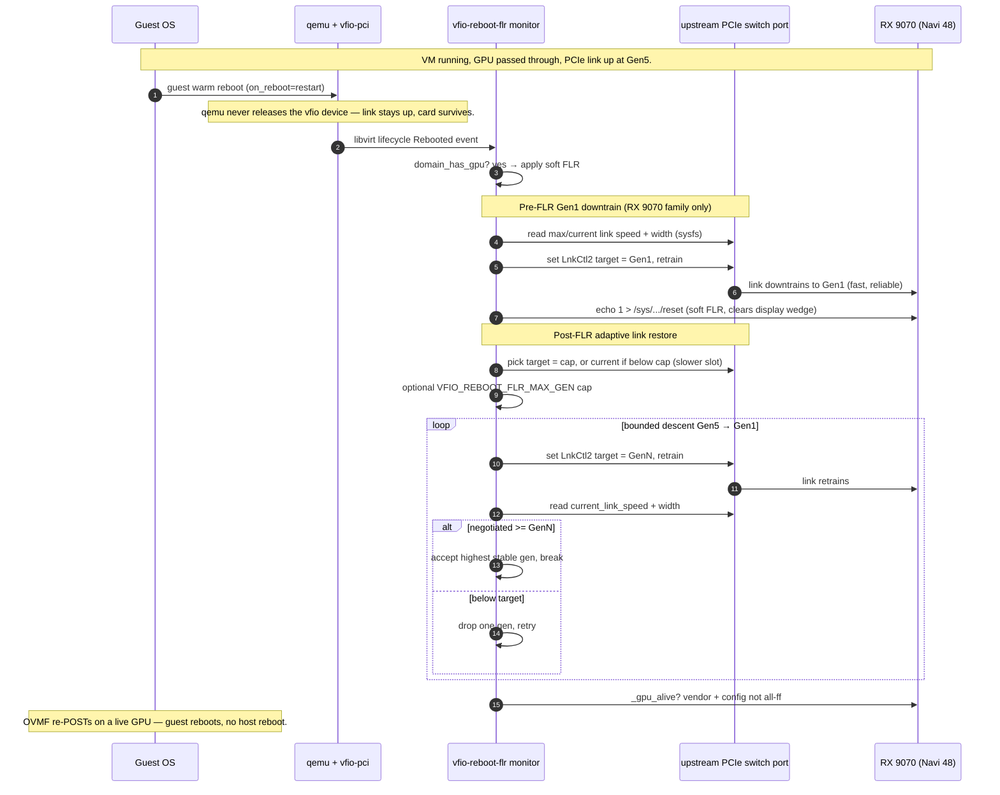
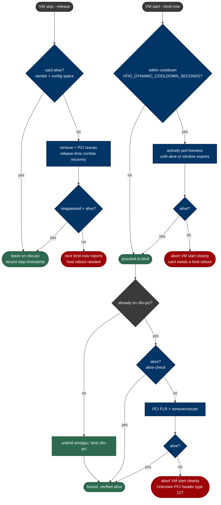
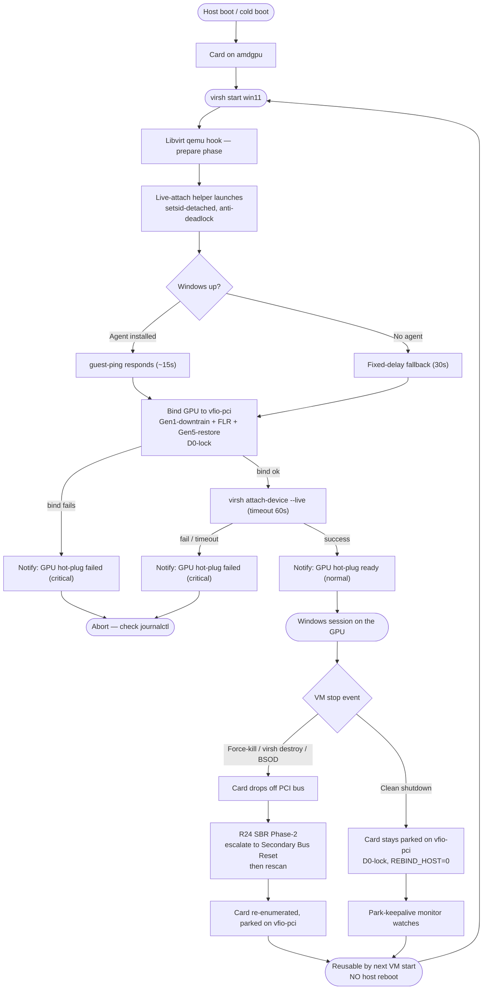
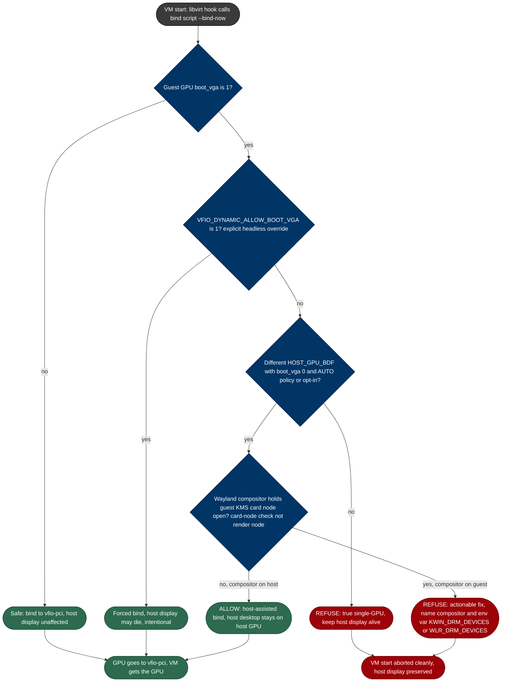
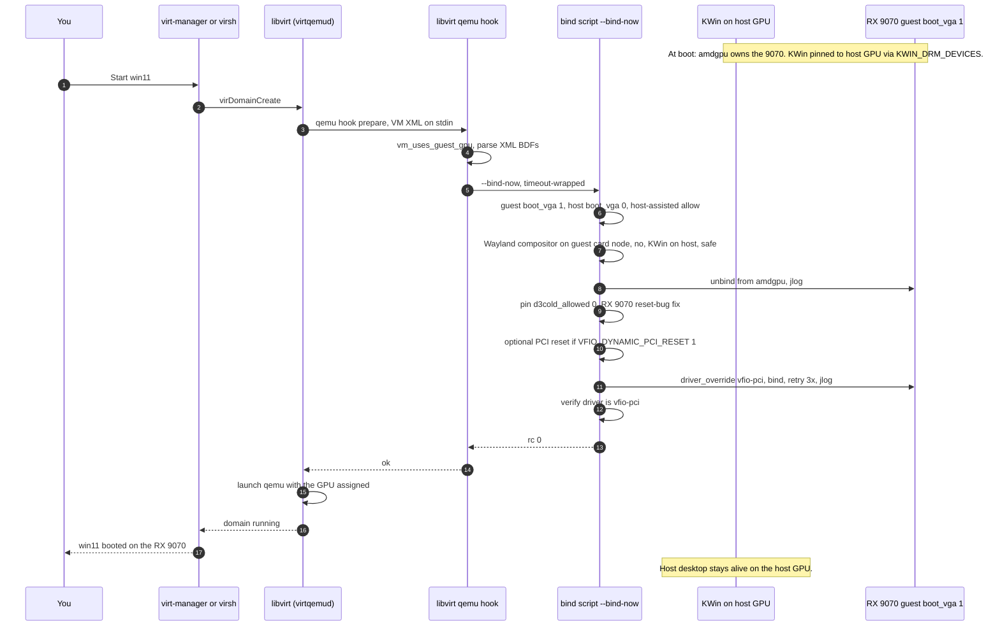

<p align="center">
  <a href="icon/images.webp">
    
  </a>
</p>

> 🖥️ **Step 2 — Looking Glass Setup**
>
> When you have completed the VFIO passthrough, the next step is to set up **Looking Glass**.
>
> 👉 [FreddeITsupport98/looking-glass-setup](https://github.com/FreddeITsupport98/looking-glass-setup)
>
> Use this repo — it auto-configures Looking Glass for you. Just follow the steps.

# vfio.sh – Safe multi‑GPU VFIO passthrough helper

## Quick links

- [What's new — RX 9070 / RDNA4 dynamic binding + Wayland render-device pinning](#whats-new--rx-9070--rdna4-dynamic-binding--wayland-render-device-pinning)
- [Keeping the RX 9070 alive: soft reboot, hard kill, and the zombie card](#keeping-the-rx-9070-alive-soft-reboot-hard-kill-and-the-zombie-card)
- [Stealth/perf VM tuning (SMBIOS / CPU / NIC / disk serials / iothreads)](#stealthperf-vm-tuning-smbios--cpu--nic--disk-serials--iothreads)
- [Why this matters for newer AMD cards](#why-this-matters-for-newer-amd-cards)
- [The two-mode choice (early vs dynamic)](#the-two-mode-choice-early-vs-dynamic)
- [How the host desktop stays alive (3 defenses)](#how-the-host-desktop-stays-alive-3-defenses)
- [Decision diagram (bind-now guard)](#decision-diagram-bind-now-guard)
- [Full VM-start flow diagram](#full-vm-start-flow-diagram)
- [Install / switch commands](#install--switch-commands)
- [GPU binding mode (early vs dynamic) — CLI reference](#gpu-binding-mode-early-vs-dynamic)
- [Unreleased / changelog](#unreleased)
- [Live-attach (hotplug GPU) workflow — the recommended RDNA4 path](#live-attach-hotplug-gpu-workflow--the-recommended-rdna4-path)
- [virtio-win guest-agent installer (smart handoff)](#virtio-win-guest-agent-installer-smart-handoff)
- [SBR Phase-2 force-kill recovery (R24)](#sbr-phase-2-force-kill-recovery-r24)
- [Park-keepalive monitor](#park-keepalive-monitor)
- [Idempotency + the stale-helper fix (R26/R31)](#idempotency--the-stale-helper-fix-r26r31)
- [Interactive installer menu (--menu)](#interactive-installer-menu)
- [Self-install (--install-self / --uninstall-self) + config pickup](#self-install)
- [Ultimate-performance VM tuning (stealth-safe)](#ultimate-performance-vm-tuning-stealth-safe)
- [Table of Contents](#table-of-contents)

## Table of Contents

- [What's new — RX 9070 / RDNA4 dynamic binding + Wayland render-device pinning](#whats-new--rx-9070--rdna4-dynamic-binding--wayland-render-device-pinning)
- [Keeping the RX 9070 alive: soft reboot, hard kill, and the zombie card](#keeping-the-rx-9070-alive-soft-reboot-hard-kill-and-the-zombie-card)
- [Live-attach (hotplug GPU) workflow — the recommended RDNA4 path](#live-attach-hotplug-gpu-workflow--the-recommended-rdna4-path)
- [virtio-win guest-agent installer (smart handoff)](#virtio-win-guest-agent-installer-smart-handoff)
- [SBR Phase-2 force-kill recovery (R24)](#sbr-phase-2-force-kill-recovery-r24)
- [Park-keepalive monitor](#park-keepalive-monitor)
- [Idempotency + the stale-helper fix (R26/R31)](#idempotency--the-stale-helper-fix-r26r31)
- [Stealth/perf VM tuning (SMBIOS / CPU / NIC / disk serials / iothreads)](#stealthperf-vm-tuning-smbios--cpu--nic--disk-serials--iothreads)
- [Why this matters for newer AMD cards](#why-this-matters-for-newer-amd-cards)
- [The two-mode choice (early vs dynamic)](#the-two-mode-choice-early-vs-dynamic)
- [How the host desktop stays alive (3 defenses)](#how-the-host-desktop-stays-alive-3-defenses)
- [Decision diagram (bind-now guard)](#decision-diagram-bind-now-guard)
- [Full VM-start flow diagram](#full-vm-start-flow-diagram)
- [Install / switch commands](#install--switch-commands)
- [GPU binding mode (early vs dynamic) — CLI reference](#gpu-binding-mode-early-vs-dynamic)
- [High-level design](#high-level-design)
- [Requirements](#requirements)
- [Installation](#installation)
- [Command-line modes](#command-line-modes)
- [Interactive installer menu (--menu)](#interactive-installer-menu)
- [Self-install (--install-self / --uninstall-self) + config pickup](#self-install)
- [Ultimate-performance VM tuning (stealth-safe)](#ultimate-performance-vm-tuning-stealth-safe)
- [Interactive wizard (default mode)](#interactive-wizard-default-mode)
- [Verification and troubleshooting](#verification-and-troubleshooting)
- [Safety model](#safety-model)
- [Known limitations](#known-limitations)
- [FAQ](#faq)
- [Contributing / customizing](#contributing--customizing)
- [Unreleased / changelog](#unreleased)

> **Status:** This script is a highly defensive, feature‑rich VFIO helper that has been hardened for modern Fedora/RHEL/Arch‑style setups, AMD reset quirks, and boot‑VGA framebuffer conflicts. It is designed as a _host configuration wizard_, **not** a VM manager.

This repository contains a single, self‑contained Bash script, `vfio.sh`, that guides you through setting up **GPU passthrough with VFIO** in a way that is:

- **Multi‑vendor aware** – works with AMD, NVIDIA and Intel GPUs
- **IOMMU‑aware** – adds the right kernel parameters for your CPU family
- **BDF‑centric** – binds **only the exact PCI devices you picked** to `vfio-pci`
- **Audio‑aware** – helps you keep host audio working while optionally passing HDMI/DP audio to the VM
- **Bootloader‑aware** – updates GRUB safely, or prints manual instructions for other bootloaders
- **Reversible** – generates a rollback script and has a full `--reset` mode

The script is designed to be **interactive, defensive and reversible**, so that you are much less likely to soft‑brick your desktop or leave your host without graphics/audio.

> **Important:** This script does *not* create or modify VMs. It only prepares your host so that a hypervisor (libvirt/qemu, etc.) can passthrough the selected PCI devices.

## What's new — RX 9070 / RDNA4 dynamic binding + Wayland render-device pinning

vfio 6.0 adds reliable passthrough for **RDNA4 / RX 9070** and other cards that hit the `Unknown PCI header type 127` reset bug, plus automatic Wayland render-device pinning so your host desktop no longer crashes when the VM starts. No BIOS visit required on a dual-GPU setup. **The practical headline: an RX 9070 passed through to a Windows guest now survives a soft reboot AND a hard kill of the VM** — reboot from the Start menu and the guest comes back to a live display with no host reboot, and `virsh destroy` / force-poweroff / a BSOD no longer drops the card into the `Unknown PCI header type 127` zombie state. See [Keeping the RX 9070 alive](#keeping-the-rx-9070-alive-soft-reboot-hard-kill-and-the-zombie-card) below.

vfio 7.0 adds the **live-attach (hotplug GPU) workflow** as the recommended RDNA4 path: the VM starts WITHOUT the GPU (Windows boots on a virtual display), and after a short delay the GPU is bound to `vfio-pci` and hot-attached to the RUNNING VM — sidestepping the cold-attach-at-boot death entirely. A **virtio-win guest-agent installer** (`--install-virtio-win-guest-agent`) attaches the driver ISO so the helper's `guest-ping` poll hot-attaches the GPU the MOMENT Windows is up (~15s vs the blind 30s), and a **hotplug-ready desktop notification** pops when the GPU is ready to use. A **SBR Phase-2 force-kill recovery** (R24) re-enumerates a force-killed card (`virsh destroy` / BSOD) via Secondary Bus Reset so it's reusable without a host reboot, and a **park-keepalive monitor** proactively recovers a card that dies while parked between sessions. See [Live-attach (hotplug GPU) workflow](#live-attach-hotplug-gpu-workflow--the-recommended-rdna4-path) below.

An **interactive installer menu** (`--menu`) lets you pick any of those actions from a TUI menu — full configure, switch dynamic/early binding, set up live-attach/hotswap, attach the virtio-win guest-agent ISO, apply/revert stealth tuning, verify, detect, reset — without running the whole wizard or remembering individual flags, and it loops back after each action so you can do several things in one session. See [Interactive installer menu](#interactive-installer-menu).

A **self-install** (`--install-self`) puts `vfio` on PATH at `/usr/local/bin/vfio` and drops the fish/bash/zsh completions into their vendor auto-load directories (no `source` step), so you can run `vfio ...` (no `.sh`) from anywhere with working completions; `--uninstall-self` removes both. And on a fresh install, if a prior run left a `/etc/vfio-gpu-passthrough.conf.bak.<ts>` backup (e.g. after `--reset`, or cloning the repo onto a host that already had VFIO) but the live config is missing, the wizard now **detects the backup and offers to pick up the same config** (restore the guest/host GPU BDFs + binding mode and re-apply the binding) instead of re-running the whole wizard. See [Self-install](#self-install).

An **ultimate-performance VM tuning** installer (`--install-ultimate-perf-vm-tuning`) layers maximum-throughput knobs (disk `cache=none`/`io=native`/multiqueue, scaled iothreads, aggressive cputune/numatune pinning, CPU topology + cache passthrough, no startup balloon, S3/S4 disabled, optional hugepages) on each guest-GPU VM **without disturbing the stealth tuning** — the perf patcher never touches the stealth elements, and reverting perf restores a backup that still contains stealth. See [Ultimate-performance VM tuning (stealth-safe)](#ultimate-performance-vm-tuning-stealth-safe).

### Keeping the RX 9070 alive: soft reboot, hard kill, and the zombie card

> **The practical result — on an RX 9070 / 9070 XT / 9070 GRE passed through to a Windows guest:**
>
> - ✅ **Windows soft reboot works.** Reboot the guest from the Start menu and it comes back to a live display — no host reboot, no frozen OVMF screen, the card never leaves the bus.
> - ✅ **Hard-killing the VM works.** `virsh destroy` / force-poweroff / a guest BSOD does not drop the card into the `Unknown PCI header type 127` zombie state; the next VM start either reuses the still-parked card or recovers it cleanly instead of crashing qemu.
> - 🔧 **The technique that makes the soft reboot reliable** is a **pre-FLR Gen1 PCIe downtrain + adaptive post-FLR link restore**: force the upstream switch port's target link speed to Gen1 *before* the function-level reset so the retrain always succeeds, then restore the link to the hardware's actual max (Gen5 on Gen5 boards, Gen4 on slower slots) with a bounded fallback. Without it, the RX 9070 family's on-card PCIe switch fails to retrain the link after an FLR and the card wedges — that is the exact failure this solves.

**Why soft reboot now works:** with `on_reboot=restart` (warm reboot), qemu never releases the vfio device, so the PCIe link stays up and the card survives — but the GPU's display engine wedges in the old guest's framebuffer and OVMF cannot re-POST (frozen screen). A systemd service (`vfio-reboot-flr.service`, installed by `--install-dynamic-binding`) watches libvirt for the guest `Rebooted` lifecycle event and does a soft function-level reset (`echo 1 > /sys/.../reset`) to clear the display wedge **without dropping the PCIe link**, then the Gen1-downtrain + adaptive restore (below) brings the link back reliably so OVMF re-POSTs on a live GPU — no host reboot needed. Gated to the RX 9070 family (vendor `1002`, device `7550` — the RX 9070, 9070 XT, and 9070 GRE all share that ID).

**Why hard kill now works:** a hard kill (`virsh destroy` / force-poweroff / BSOD) tears the VM down through the libvirt `stopped`/`release` hook. The card is left **parked on vfio-pci** (the safer default, `VFIO_DYNAMIC_REBIND_HOST=0`) so it never re-enters amdgpu and never hits the D3cold exit that drops it off the bus; if it died anyway during the kill, a release-time `remove`+`rescan` recovery is attempted immediately, and the next `--bind-now` is gated by a cooldown readiness probe + an alive-check that either waits for the card to recover or aborts the VM start cleanly with an actionable message instead of handing qemu a dead card. That is the three-layer zombie recovery detailed further below.

The rest of this section details the three mechanisms behind those two results. The hardest remaining RX 9070 / RDNA4 passthrough problems are **not** the first bind — they are what happens *after* the VM is running: the guest warm-reboot display wedge, the post-FLR Gen5 link that won't come back, and the card that dies into "zombie mode" on a rapid stop/start. vfio 6.0 has a concrete, working mitigation for each. This is the part that makes the script more than a general VFIO helper.

**1. Soft reboot keeps the card alive (reboot-FLR monitor).** With `on_reboot=restart` (warm reboot), qemu never releases the vfio device, so the PCIe link stays up and the card survives — but the GPU's display engine wedges in the old guest's framebuffer and OVMF cannot re-POST (frozen screen). A systemd service (`vfio-reboot-flr.service`, installed by `--install-dynamic-binding`) watches libvirt for guest reboot lifecycle events and does a soft function-level reset (`echo 1 > /sys/.../reset`) on the guest GPU to clear the display wedge **without dropping the PCIe link**, so OVMF re-POSTs and the guest reboots cleanly — no host reboot needed. Gated to the RX 9070 family (vendor `1002`, device `7550` — the RX 9070, 9070 XT, and 9070 GRE all share that ID).

**2. Gen1-downtrain + adaptive link restore (the technique that makes the FLR reliable).** A bare FLR on the RX 9070 family drops the link and the on-card PCIe switch fails to retrain it at Gen5. The fix, verified on ASUS TUF X570-PLUS + RX 9070:
  - **before** the FLR: force the upstream switch port's target link speed to **Gen1** (`LnkCtl2` low nibble = 1) and retrain, so the link downtrains to Gen1 immediately — Gen1 retrains fast and always succeeds;
  - **after** the FLR: adaptively restore the link to the hardware's **actual** max — Gen5 on Gen5 boards, Gen4 on slower slots — instead of blindly forcing Gen5.
  The restore reads the upstream port's sysfs `max_link_speed` / `current_link_speed`, keeps a proven slower gen when the link was already running below cap (slower slot / signal integrity / Gen4 board), and does a **bounded descent** (Gen5 → Gen4 → … → Gen1) accepting the highest gen the link actually negotiates at — so a board that only retrains Gen4 after an FLR settles at Gen4 instead of failing. Link **width** is logged too (an x16→x8 degradation from a bad slot/cable is otherwise invisible), a GPU-endpoint alive-check catches a wedged GPU behind a live link, the SKU (9070 / 9070 XT / 9070 GRE, told apart by PCI revision) is named in the log, and an optional `VFIO_REBOOT_FLR_MAX_GEN` cap (1–6) lets you pin the restore to a lower gen on boards that never retrain the card's full cap.



**3. Zombie mode after stop/reboot, solved in practice.** A rapid VM stop/start (or a stop → reboot) can drop the RX 9070 off the PCI bus on the D3cold exit — the card looks "alive" per the cached vfio-pci driver symlink but its config space reads all `0xff`, and qemu crashes with `Unknown PCI header type 127`. vfio 6.0 handles this at three layers instead of letting qemu crash:
  - **release-time zombie recovery**: on VM stop (`--release`), if the card is already dead, attempt a `remove` + PCI `rescan` immediately while it is in a fresher state (a healthy card is never touched, so the parked-on-vfio-pci invariant is preserved);
  - **cooldown readiness probe**: on the next VM start within `VFIO_DYNAMIC_COOLDOWN_SECONDS` (default 10s), actively poll the card's liveness (`vendor` sysfs + live config space) until it recovers or the window expires — a card that recovers early proceeds immediately, a card still dead after the window fails with an actionable "card needs a host reboot" message;
  - **alive-check + clean abort**: before reporting bind success, read `vendor` sysfs + live config space (rejecting `0xffff` / all-`0xff`); a dead card gets one PCI reset + remove/rescan attempt, and if still dead the VM start is aborted cleanly so libvirt never hands qemu a dead card (the success log says `bound to vfio-pci (verified, alive)`).



These three mitigations run automatically once `--install-dynamic-binding` is in place — no per-reboot manual steps. Follow them live with `journalctl -t vfio-reboot-flr -f` (reboot-FLR monitor) and `journalctl -t vfio-dynamic -f` (bind/release + zombie recovery).

## Live-attach (hotplug GPU) workflow — the recommended RDNA4 path

The hardest remaining RX 9070 / RDNA4 problem is **not** the first bind — it is the **cold-attach-at-boot death**: on the first VM start (or a parked restart), qemu's attach-time bus reset kills the card before the AMD Windows driver can stabilize it. The live-attach (hotplug GPU) workflow sidesteps this entirely: the VM starts WITHOUT the GPU (Windows boots on a virtual display), and after a short delay the GPU is bound to `vfio-pci` and hot-attached to the RUNNING VM via `virsh attach-device --live` — handed to a driver-ready guest instead of cold-attached at boot. This is the recommended path for RX 9070 / RDNA4.

### The one-command dynamic-install chain (RDNA4)

A single `--install-dynamic-binding` run walks the whole RDNA4 chain in one prompted sequence:

1. **Dynamic binding** — `amdgpu` loads first, a libvirt qemu hook switches the guest GPU to `vfio-pci` only when a VM that has it attached is started.
2. **Live-attach (opt-in, default N)** — strips the GPU hostdev from the VM XML (a full backup is saved per VM), installs the live-attach helper + hook + bind script.
3. **virtio-win ISO attach (opt-in, default N, gated on live-attach)** — attaches the virtio-win driver ISO as a SATA CD-ROM to each guest-GPU VM so you can install the QEMU guest agent inside Windows.

```fish path=null start=null
sudo ./vfio.sh --install-dynamic-binding
```

The full live-attach flow on VM start:



### The live-attach helper

The generated helper (`/usr/local/sbin/vfio-live-attach.sh`, launched by the libvirt hook on VM `prepare`) does three things:

- **Smart handoff via `guest-ping`**: polls the QEMU guest agent (`virsh qemu-agent-command ... guest-ping`) so the GPU hot-attaches the MOMENT Windows userspace is up — often ~15s instead of the full 30s blind fixed delay. The QEMU guest-agent `<channel>` is auto-injected into the VM XML by `install_live_attach`. **Fixed-delay fallback**: if the agent is not installed in Windows yet (or no channel), the helper proceeds after `VFIO_DYNAMIC_LIVE_ATTACH_DELAY` (default 30s) — nothing breaks until the agent is installed.
- **Hotplug-ready desktop notification**: fires `notify-send` (broadcast to every `/run/user/<uid>` via `runuser`, same pattern as the park-keepalive monitor) on attach success (*"GPU hot-plug ready — ready to use"*, normal urgency) and on bind/attach/missing-XML failures (*"GPU hot-plug failed"*, critical urgency). You see the GPU is ready without watching the journal.
- **Anti-deadlock**: launched `setsid`-detached with `</dev/null >>log 2>&1 &` so the helper does NOT hold the libvirt hook's stdout/stderr pipe open (a bare `&` child would make libvirt wait for EOF and block qemu start until the helper timed out — observed 92s-late VM start).

### virtio-win guest-agent installer (smart handoff)

`--install-virtio-win-guest-agent` resolves the virtio-win driver ISO and attaches it as a **SATA CD-ROM** to each shut-off guest-GPU VM (idempotent — skips a VM that already has it; auto-assigns a free `sdX` target; `virt-xml-validate` + `virsh define`). Then you run `virtio-win-guest-tools.exe` inside Windows to install the agent + all virtio drivers.

**Distro-aware ISO resolution** (R28b/R30):
- **Fedora/RHEL-family (dnf)**: `virtio-win` is NOT in the default repos — the script adds the fedorapeople virtio-win repo first (`curl`/`wget` the `.repo` to `/etc/yum.repos.d/virtio-win.repo`), then `dnf install virtio-win` → ISO lands at `/usr/share/virtio-win/virtio-win.iso`.
- **openSUSE (zypper)**: tries `zypper in virtio-win`; on failure points to the direct RPM download.
- **Debian/Ubuntu (apt) / Arch/CachyOS (pacman)**: no official virtio-win package → prints the links so you download the ISO yourself to `/var/lib/vfio-dynamic/virtio-win.iso` and re-runs. **No 270MB ISO auto-download** — link-only.
- A user-provided ISO at `/var/lib/vfio-dynamic/virtio-win.iso` is picked up automatically.

Driver ISO archive (all released versions): `https://fedorapeople.org/groups/virt/virtio-win/direct-downloads/archive-virtio/?C=M;O=A`

### SBR Phase-2 force-kill recovery (R24)

A force-killed VM (`virsh destroy` / force-poweroff / BSOD) drops the RX 9070 off the PCI bus. The lighter Phase-1 `remove+rescan` recovery often **fails** on Navi 48. The bind script and the park-keepalive monitor now **escalate to a Secondary Bus Reset** (`_secondary_bus_reset` — RST# pulse on the upstream port via BridgeCtl `0x3E` bit 6) + rescan, so the force-killed card is re-enumerated, parked back on `vfio-pci`, and reusable by the next live-attach — **without a host reboot**. Works for both live-attach and standard dynamic binding (shared release path + keepalive). LIVE-verified: the card survived `virsh destroy`, stayed parked on `vfio-pci`, and the VM restarted on the same card without a host reboot.

### Park-keepalive monitor

A systemd service (dynamic binding only, installed automatically) that periodically checks whether the guest GPU parked on `vfio-pci` between VM sessions is still alive, and proactively runs the same `remove+rescan` → SBR Phase-2 recovery if it has died — the PROACTIVE complement to the reactive release-time zombie recovery. It catches a card that dies while parked BETWEEN VM stop/start events, not just at the moment of VM stop. Disable via `VFIO_DYNAMIC_PARK_KEEPALIVE=0` in `$CONF_FILE`. Includes a systemd-sleep resume hook (S3/S4 sleep is a common D3cold trigger) and a backoff streak with a one-time notify threshold.

### Idempotency + the stale-helper fix (R26/R31)

- **R26**: a re-run of `--install-live-attach` (or accepting the dynamic-install prompt) when live-attach is already active detects the already-active state and prints the green *"✔ Live-attach is already active"* banner + returns 0, instead of a confusing *"No shut-off VMs found"* error.
- **R31**: the already-active path now **regenerates the helper + hook + bind-script before returning**. Without this, a re-run that hit the idempotency path shipped a stale helper on disk (pre-R27, no `_notify_desktop`) and the hotplug-ready desktop notification never fired even though the attach succeeded. A re-run now deploys helper code updates instead of shipping a stale helper.

### Revert / uninstall

- `sudo ./vfio.sh --install-dynamic-binding` — restores normal binding + re-attaches the GPU from the per-VM backup + detaches the virtio-win ISO CD-ROM (the uninstaller only removes a cdrom whose source is one of the two script-managed ISO paths — a real optical drive or a different ISO is never touched).
- `sudo ./vfio.sh --reset` — full cleanup (removes live-attach, the ISO CD-ROM, vBIOS pins, monitors, hook, conf).


### Stealth/perf VM tuning (SMBIOS / CPU / NIC / disk serials / iothreads)

vfio 6.0 also absorbs the Stealthy-VM tuning (MIT-licensed, by Fredrik Bäckström) so a Windows guest looks more like a real desktop PC and gets perf tuning — applied directly to the detected guest-GPU VMs at install time, with verification before anything is redefined.

**What it does** (to each shut-off VM that has the guest GPU attached):
- **Hypervisor hide**: `hyperv vendor_id=GENUINE00000` + `kvm hidden` (so the AMD Windows driver installs the real display driver).
- **CPU**: `host-passthrough` + the `hypervisor` CPUID bit disabled; QEMU `-cpu host,kvm=off,hypervisor=off,hv_vendor_id=null,invtsc=on`.
- **SMBIOS spoofing** from the **host's real DMI** (`/sys/class/dmi/id/*`) — BIOS vendor/version/date + system manufacturer/product with a randomized serial/UUID — so the VM's SMBIOS matches your actual hardware, not a generic ASUS B550 (falls back to defaults if DMI is unreadable).
- **Devices**: virtio NIC → `e1000e`; randomized disk serials; `memballoon=none`; tablet input removed (USB mouse kept); `hypervclock` off; TSC native.
- **Perf**: `iothreads=1`, host-aware `cputune` (vCPU/emulator/iothread pinning based on host core count), disk iothread assignment.
- **Preserves your existing `<qemu:commandline>` args** (e.g. Looking Glass `kvmfr`) — it dedupes its own `-cpu`/`-smbios` pairs instead of wiping the commandline, so re-running is idempotent.

**Safety / verify-before-define**: for each VM it dumps + backs up the XML, runs the tuning on a temp copy, validates with `virt-xml-validate`, and prompts before `virsh define`. Running VMs are skipped. `--dry-run` shows a `diff -u` of the changes.

```fish path=null start=null
# During a dynamic install (opt-in prompt, default N):
sudo ./vfio.sh --install-dynamic-binding --stealth-vm-tuning

# Re-apply/refresh tuning on existing VMs without the full wizard:
sudo ./vfio.sh --install-stealth-vm-tuning

# Preview the changes without redefining (dry-run diff per VM):
sudo ./vfio.sh --install-stealth-vm-tuning --dry-run

# Revert a VM from its most recent *_stealth_*.xml backup:
sudo ./vfio.sh --reset-stealth-vm-tuning

# Check tuning status (in --detect / --verify):
sudo ./vfio.sh --verify
```

Backups go to `STEALTH_VM_BACKUP_DIR` (conf key, default `$HOME/Desktop`, falls back to `/var/lib/vfio-stealth-vm/backups`). `--reset` does NOT revert VM XMLs — use `--reset-stealth-vm-tuning` for that. This is cosmetic realism + perf tuning, **not** an anti-cheat bypass.

### Ultimate-performance VM tuning (stealth-safe)

vfio 7.1 adds a SEPARATE, more aggressive **ultimate-performance** VM tuning installer that layers maximum-throughput knobs on each shut-off guest-GPU VM, **while keeping the stealth tuning intact**. The stealth tuning (vendor_id, kvm hidden, vmport, SMBIOS, e1000e NIC, disk serials, memballoon=none, hypervclock/TSC, QEMU -cpu/-smbios) is never touched by the perf patcher — a stealth-tuned VM stays stealth-tuned through a perf pass, and reverting perf restores a pre-perf backup that still contains stealth.

**What it does** (to each shut-off VM that has the guest GPU attached):
- **Disk I/O** (the biggest safe win): `cache=none` (O_DIRECT, no double cache) + `io=native` (Linux AIO, best latency) + `discard=unmap` (SSD trim passthrough); virtio-blk multiqueue `queues=<vcpu>`; per-disk `iothread` round-robin assignment.
- **iothreads scaling**: bumps `<iothreads>` to `min(vcpu,4)` and round-robin-assigns disks across them (the stealth `iothreads=1` is upgraded, not duplicated — idempotent).
- **cputune + numatune (aggressive pinning)**: reads host topology (`lscpu` + `/sys/devices/system/node`); pins vCPUs to physical cores, `emulatorpin` to a housekeeping core, `iothreadpin` per iothread. `numatune` memory strict-pinning is added **only when NUMA-safe** (single node, or all pinned vCPUs fit one node) — otherwise skipped so the VM never fails to start. Falls back to simple `v->v` pinning if host topology is unreadable.
- **CPU topology + cache**: adds `<topology sockets/cores/threads>` matching the vCPU count + `<cache mode='passthrough'/>` under `<cpu>`. Does NOT change stealth's `host-passthrough` mode or the `hypervisor` CPUID disable.
- **currentMemory = memory**: the VM starts at full allocation (no startup balloon) — synergizes with stealth's `memballoon=none`.
- **`<pm>` S3/S4 disabled**: faster boot; avoids guest suspend breaking passthrough.
- **Hugepages (OPT-IN, the only host-RAM knob)**: when opted in, adds `<memoryBacking><hugepages>` + reserves the matching host `nr_hugepages` (prior value backed up, reverted by `--reset-ultimate-perf-vm-tuning`). Default OFF so a plain run never touches host RAM; all other perf knobs still apply without it. The reservation is hardened so a failed/short reservation never leaves a VM defined with a `<memoryBacking>` it can't satisfy:
  - **KiB units**: the `<page>` element uses libvirt's `unit="KiB"` convention (2048 KiB = 2 MiB = the standard 2MB hugepage), NOT MiB — so the page size matches what the kernel's `nr_hugepages` knob actually allocates.
  - **Reserve-first + verify**: the host `nr_hugepages` is reserved BEFORE the VM XML is defined, and the knob is re-read after the write to confirm the kernel delivered the full count. A runtime write can grant FEWER pages than requested on a fragmented host; on a shortfall the pool is reverted and hugepages is turned OFF for that run (the VM keeps every other perf knob and still starts), with a WARN naming the shortfall and the boot-time `hugepages=N` kernel-cmdline fallback (reboot-safe, can't be fragmented out).
  - **RAM-change aware**: the page count is recomputed from the VM's CURRENT `<memory>` each run (grow = add, shrink = free), instead of only ever adding. The count THIS VM owns is persisted per-VM, so a RAM shrink frees exactly this VM's surplus while preserving other tuned VMs' reservations.
  - **Reboot-safe re-reserve**: after a host reboot resets `nr_hugepages` to 0, the next run re-reserves automatically (no early skip), so a rebooted host no longer silently breaks `virsh start`.
  - **1GB guard**: a 1GB page size (`1048576` KiB) cannot be reserved at runtime (the `nr_hugepages` knob only controls the 2MB pool); the helper warns and skips the runtime write, pointing at the `hugepagesz=1G hugepages=N` kernel-cmdline requirement.

**Stealth coexistence guarantee**: the perf patcher only touches the elements above; it never reads/writes `features/hyperv/vendor_id`, `kvm/hidden`, `vmport`, `os/smbios`, `sysinfo`, `interface/model` (e1000e), `disk/serial`, `memballoon`, `clock/timer` (hypervclock/tsc), or `qemu:commandline` (-cpu/-smbios). Reverting perf restores the pre-perf XML backup (which still contains stealth), so stealth survives a perf revert.

**Live-attach aware**: the tuner detects a guest-GPU VM by the GPU PCI hostdev in its XML **or** by membership in the live-attach VM list (`/var/lib/vfio-dynamic/live-attach-vms`). Live-attach strips the GPU hostdev from the persistent XML so the VM can boot without the GPU and hot-attach it later — so a hostdev-only check would miss an already-live-attach-configured VM and force you to revert live-attach before tuning. The live-attach fallback (shared with the stealth tuner and the virtio-win ISO installer) lets you tune a live-attach VM directly in its shut-off state without touching the live-attach setup. The perf, stealth, and status functions all use this shared detection.

**SATA→virtio-blk disk conversion (opt-in, DANGEROUS)**: the disk perf knobs (`cache=none`/`io=native`/`discard=unmap` + multiqueue + iothread) only apply to **virtio/scsi** disks — a SATA boot disk gets none of them. When you opt in (`--ultimate-perf-virtio-disk` or the `ULTIMATE_PERF_VIRTIO_DISK=1` conf key), the tuner converts each non-cdrom disk on a non-virtio/non-scsi bus to `bus='virtio'` (`sdX`→`vdX`, collision-checked, SATA `<address type='drive'>` dropped so libvirt reassigns PCI on define), then applies the perf knobs to the now-virtio disk. CDROMs are never converted. **DANGER: Windows needs the virtio-blk (viostor) driver installed FIRST** or it will BSOD with `INACCESSIBLE_BOOT_DEVICE` on the next boot. The correct sequence:
1. `sudo vfio --install-virtio-win-guest-agent` — attaches the virtio-win driver ISO as a CD-ROM
2. Boot the VM, run `virtio-win-guest-tools.exe` inside Windows (installs viostor + all virtio drivers), shut down
3. `sudo vfio --install-ultimate-perf-vm-tuning --ultimate-perf-virtio-disk` — now safe to convert

Default OFF (a plain run never changes the disk bus). Idempotent (a re-run on an already-virtio disk is a no-op).

**Safety / verify-before-define**: for each VM it dumps + backs up the XML to `${vm}_perf_<ts>.xml`, runs the tuning on a temp copy, validates with `virt-xml-validate`, and prompts before `virsh define`. Running VMs are skipped. `--dry-run` shows a `diff -u` of the changes. Idempotent (a re-run on an already-tuned VM reports "no changes needed").

```fish path=null start=null
# Apply ultimate-performance tuning (stealth-safe) to detected guest-GPU VMs:
sudo ./vfio.sh --install-ultimate-perf-vm-tuning

# Same, but also reserve host hugepages (opt-in) for each tuned VM:
sudo ./vfio.sh --install-ultimate-perf-vm-tuning --ultimate-perf-hugepages

# Same, but also convert SATA disks to virtio-blk (DANGER: install viostor in
# Windows first via --install-virtio-win-guest-agent + virtio-win-guest-tools.exe,
# or Windows BSODs INACCESSIBLE_BOOT_DEVICE on next boot):
sudo ./vfio.sh --install-ultimate-perf-vm-tuning --ultimate-perf-virtio-disk

# Preview the changes without redefining (dry-run diff per VM):
sudo ./vfio.sh --install-ultimate-perf-vm-tuning --dry-run

# Revert from the most recent *_perf_*.xml backup (also restores nr_hugepages):
sudo ./vfio.sh --reset-ultimate-perf-vm-tuning

# Check perf status (in --detect / --verify):
sudo ./vfio.sh --verify
```

Backups go to `ULTIMATE_PERF_VM_BACKUP_DIR` (conf key, default `$HOME/Desktop`, falls back to `/var/lib/vfio-perf-vm/backups`), separate from `STEALTH_VM_BACKUP_DIR` so the two layers' backups never collide. Hugepages size is `ULTIMATE_PERF_HUGEPAGES_SIZE` in **KiB** (default `2048` KiB = 2 MiB = the standard 2MB hugepage; `1048576` for 1GB pages — guarded, see above). SATA→virtio disk conversion is `ULTIMATE_PERF_VIRTIO_DISK` (default empty = opt-in prompt; `1` = convert, `0` = skip). `--reset` does NOT revert perf VM XMLs — use `--reset-ultimate-perf-vm-tuning` for that. Performance tuning ONLY.

### Why this matters for newer AMD cards

Newer AMD cards (RX 9070 / RX 9070 XT / RX 9070 GRE, Navi 48, RDNA4) have a reset bug: binding the guest GPU to `vfio-pci` **too early** (at host boot) can make the card fall off the PCI bus on a D3cold exit, and the first bind fails with `amdgpu: Unknown PCI header type 127`. The classic early-binding setup (`vfio-pci.ids=...` + `rd.driver.pre=vfio-pci` at boot) is exactly the path that triggers this.

A common dual-GPU topology also makes the obvious workaround dangerous: your firmware POSTs the RX 9070 as Boot VGA (`boot_vga=1`) because it is in the primary slot, while your host display is physically on a second, weaker GPU (e.g. an RX 6400 with `boot_vga=0`). On KDE Plasma Wayland, KWin renders on the `boot_vga=1` card by default — on the RX 9070, not on the card your monitor is cabled to. Binding the RX 9070 to vfio-pci at VM start then rips the GL context out from under the compositor, `kwin_wayland` segfaults mid-frame (`GLVertexBuffer::endOfFrame`), and the whole host desktop dies. vfio 6.0 solves both.

### The two-mode choice (early vs dynamic)

- **early binding** (classic, boot-time): `vfio-pci` claims the guest GPU at boot via `vfio-pci.ids` + `rd.driver.pre=vfio-pci` + a systemd unit. Works with raw qemu. Triggers the RX 9070 / RDNA4 reset bug on affected cards, and the guest GPU is not usable by the host between reboots.
- **dynamic binding** (libvirt hook, **recommended for RDNA4**): `amdgpu` loads first and the host can use the card; a libvirt qemu hook switches the guest GPU to `vfio-pci` only when a VM that has it attached is started. Avoids the reset bug (the card never sits on vfio-pci at boot), the guest GPU stays usable by the host until VM start, more reliable for RX 9070 / RDNA4. Requires libvirt-managed VMs.

Both modes keep `vfio-pci.disable_idle_d3=1` and `pcie_port_pm=off` on the kernel cmdline (these prevent the D3cold exit that drops the card off the bus).

### How the host desktop stays alive (3 defenses)

1. **Boot-VGA host-assisted escape (bind-time)**: when the VM starts, the bind script checks whether a different `HOST_GPU_BDF` has `boot_vga=0`; if so it allows the bind (mirroring the early-binding `boot_vga_guard()`). A true single-GPU topology is still hard-refused. Override: `VFIO_DYNAMIC_ALLOW_BOOT_VGA=1`.
2. **Wayland render-device pinning (install-time, durable)**: the installer writes a session env drop-in that pins the compositor to the **host** GPU so it never renders on the guest (Boot VGA) GPU — `KWIN_DRM_DEVICES` for KDE/KWin and `WLR_DRM_DEVICES` for sway/hyprland/labwc/wlroots. No-op unless the guest is `boot_vga=1`; removed by `--reset` and `--install-early-binding`.
3. **compositor-aware bind-now guard (runtime, point-in-time)**: even with the pin, if a Wayland compositor is still rendering on the guest GPU when the VM starts (e.g. you started the VM before re-logging in), the bind script refuses with an actionable message naming the detected compositor and its correct env var instead of letting kwin segfault. The guard checks the compositor's **KMS card node** (the device it holds DRM master on), not the render node (Mesa opens every render node for EGL/PRIME sharing, so a render-node check would false-positive on a healthy dual-GPU setup).

### Decision diagram (bind-now guard)

The flow below shows what the generated bind script decides at VM start (`--bind-now`). Green nodes allow the bind, red nodes refuse it cleanly so libvirt aborts the VM start and the host display stays alive, blue nodes are the safety checks.



### Full VM-start flow diagram

The sequence below shows the complete VM-start flow on a dual-GPU setup with the RX 9070 as the guest (Boot VGA) GPU. At boot amdgpu owns the 9070 and KWin is pinned to the host GPU via `KWIN_DRM_DEVICES`; the host desktop stays alive on the host GPU throughout.



### Install / switch commands

```fish path=null start=null
# Full guided install (picks a binding mode, installs the render-device pin
# automatically if the guest is Boot VGA):
sudo ./vfio.sh

# Switch an existing setup to dynamic binding (RX 9070 / RDNA4 recommended):
#   regenerates the bind script with the latest guard, reinstalls the hook,
#   writes the KWIN_DRM_DEVICES / WLR_DRM_DEVICES pin.
sudo ./vfio.sh --install-dynamic-binding

# Switch back to early binding (also removes the render-device pin):
sudo ./vfio.sh --install-early-binding

# Live-attach (hotplug GPU) workflow — RECOMMENDED for RX 9070 / RDNA4.
#   The VM starts WITHOUT the GPU; after a delay the GPU is hot-attached
#   to the running VM. Requires --install-dynamic-binding first, and the
#   AMD Windows driver MUST be installed in the guest.
sudo ./vfio.sh --install-live-attach

# virtio-win guest-agent installer (smart handoff) — attaches the virtio-win
#   driver ISO to each guest-GPU VM as a SATA CD-ROM so you can run
#   virtio-win-guest-tools.exe inside Windows to install the QEMU guest agent.
#   On Fedora, adds the fedorapeople virtio-win repo first, then dnf install.
sudo ./vfio.sh --install-virtio-win-guest-agent

# Interactive installer menu — pick what to do without running the whole
#   wizard or remembering individual flags (full configure, switch binding
#   mode, live-attach, virtio-win, stealth tuning, verify, detect, reset).
sudo ./vfio.sh --menu

# Install vfio as /usr/local/bin/vfio (on PATH) + shell completions (auto-load):
sudo ./vfio.sh --install-self
# Remove the self-installed vfio + completions (separate from --reset):
sudo ./vfio.sh --uninstall-self

# Full cleanup / undo everything:
sudo ./vfio.sh --reset
```

After `--install-dynamic-binding`, log out and back in (or reboot) so the compositor picks up the render-device pin, then start the VM.

**Verification cheat-sheet** (fish):
```fish path=null start=null
# which GPU is which
lspci -nn | grep -iE 'VGA|3D'
for f in /sys/bus/pci/devices/*/boot_vga; echo (basename (dirname $f)) boot_vga=(cat $f); end

# which card is KWin rendering on? (should be the HOST card)
sudo ls -l /proc/(pgrep -x kwin_wayland)/fd | grep -oE '/dev/dri/card[0-9]+' | sort -u

# is the render-device pin in kwin's env?
sudo grep -ao 'KWIN_DRM_DEVICES=[^[:cntrl:]]*' /proc/(pgrep -x kwin_wayland)/environ

# follow the bind sequence live
journalctl -t vfio-dynamic -f
```

### Rapid stop/start and the header-127 alive-check

Rapid VM stop/start cycles (stopping the VM and starting it again within a few seconds) can still drop the RX 9070 / RDNA4 off the PCI bus via the same D3cold reset bug — that is hardware/firmware, not something any bind script can prevent. vfio 6.0 now handles this case cleanly instead of letting qemu crash:

- **Alive-check before reporting bind success**: the generated bind script's `--bind-now` path reads the guest GPU `vendor` sysfs and live `config` space (rejecting `0xffff` and all-`0xff`) before it reports success. A card that is on `vfio-pci` per the driver symlink but unreadable (fallen off the bus) is no longer reported as a successful bind.
- **Clean abort instead of `Unknown PCI header type 127`**: if the card is dead on the "already on vfio-pci" early-return or after the bind retry loop, the bind script attempts a PCI function-level reset once; if the card is still dead, it logs and exits non-zero with an actionable message ("config space all 0xff, qemu would report Unknown PCI header type 127, card needs a host reboot") so libvirt aborts the VM start cleanly before qemu ever touches the dead card. The success log now says `bound to vfio-pci (verified, alive)`.
- **Cooldown readiness probe (proactive)**: the bind script records a timestamp on every VM stop (`--release`) and, on the next `--bind-now` within `VFIO_DYNAMIC_COOLDOWN_SECONDS` (default 10s) of that stop, ACTIVELY polls the card's liveness (vendor sysfs + live config space) until it is alive OR the cooldown window expires — instead of a dumb fixed-time gate. A card that recovered early proceeds immediately (no need to wait the full window); a card that is still dead after the window fails with an actionable "card needs a host reboot" message so libvirt aborts the VM start cleanly before any sysfs writes. This is the proactive complement to the reactive alive-check — it gives the card time to recover from a rapid stop/start and only fails if it does NOT. Set `0` in `/etc/vfio-gpu-passthrough.conf` to disable; keep it below `VFIO_HOOK_BIND_TIMEOUT` (default 20) so the probe cannot hit the hook deadline.
- **Reducing the chance of the card dying between cycles**: the cooldown (above) automates the "wait a few seconds" advice. As an additional opt-in, `VFIO_DYNAMIC_PCI_RESET="1"` in `/etc/vfio-gpu-passthrough.conf` forces a PCI function-level reset on every bind (costs ~0.5s per VM start; can clear residual amdgpu state that causes the header-127 bind failure).

## Unreleased
- No pending unreleased README notes.
- Add upcoming updates below this line as new work lands.
- **R34**: added self-install + config pickup. `--install-self` copies this script to `/usr/local/bin/vfio` (on PATH as `vfio`) and drops the fish/bash/zsh completions into their vendor auto-load directories (`/usr/share/fish/vendor_completions.d`, `/usr/share/bash-completion/completions`, `/usr/share/zsh/site-functions`) so they load with no `source` step; idempotent (re-run to update), backs up any prior installed copy, has a same-file guard so running the installed copy refreshes completions only, dry-run aware. `--uninstall-self` removes the installed copy + the 3 completion files (our names only); idempotent; prompts before removing; does NOT touch the VFIO config (`--reset`) or the repo copy. `--reset` gained an additive hint pointing at `--uninstall-self`. New `maybe_pickup_leftover_conf()`: when the install wizard (or `--menu` Full configure) starts and `$CONF_FILE` is missing but a `$CONF_FILE.bak.<ts>` exists, it globs the newest backup, prints a summary (guest/host GPU BDFs + binding mode + ts), prompts (default Y) to restore, copies the backup to `$CONF_FILE`, and re-applies the binding via the existing dynamic/early switchers, then exits 0 so the wizard is skipped. Wired into `preflight_existing_config_gate`. Full CLI wiring (MODE comment, parse_args, usage one-liner + help, fish/bash/zsh completions, main dispatch) mirroring the R33 `--menu` pattern; two new `--menu` entries. Also hardened `prompt_yn` to fall back to stdin when `/dev/tty` is unusable (setsid / sudo without an allocated tty / CI). New `regression/self-install-smoke.sh` (temp-root install + idempotency + same-file guard + uninstall + pickup extraction; rc=0) and an R34 assertion block in `regression/live-attach-regression.sh`; updated the R23/R27/R33 contiguous-substring assertions for the new `--install-self --uninstall-self` / `| install-self | uninstall-self |` tokens.
- **R33**: added an interactive installer menu (`--menu`) — launches `vfio_menu()`, a whiptail TUI (plain-text numbered fallback under `--no-tui` / no whiptail) that loops back after each action so you can configure / switch binding / live-attach / virtio-win / stealth / verify / detect / reset without running the whole wizard or remembering individual flags. The `--menu` dispatch requires root + writable-root in `main()` (preserves `--menu` across the sudo re-exec that `require_root` performs); each menu option dispatches to the same installer function the corresponding `--install-*` flag uses, with the same root / systemd / writable-root / libvirt / conf guards, so a menu action is equivalent to running that flag. The status header (config present + binding mode) refreshes each loop. Full CLI wiring (MODE comment, parse_args, usage one-liner + help, fish/bash/zsh completions, main dispatch). Extended `regression/live-attach-regression.sh` with an R33 assertion block (vfio_menu function + dispatch targets + loop-back + exit + full CLI/completion wiring) and updated the R23/R27 contiguous-substring assertions for the new `--menu` / `| menu |` tokens; updated `regression/dynamic-binding-smoke.sh` likewise.
- Added a PCI device alive-check to the generated bind script (`--bind-now`) so a guest GPU that has fallen off the PCI bus (D3cold reset bug from rapid VM stop/start cycles, config space all 0xff) is no longer reported as a successful bind: the "already on vfio-pci" early-return and the post-bind verify now both read `vendor` sysfs and live `config` space, attempt a PCI function-level reset once if the card is dead, and on a still-dead card log + exit non-zero with an actionable "Unknown PCI header type 127, card needs a host reboot" message so libvirt aborts the VM start cleanly instead of qemu crashing. Success log now says `bound to vfio-pci (verified, alive)`.
- Documented rapid VM stop/start guidance: rapid cycles can still drop the RX 9070 / RDNA4 off the bus (hardware/firmware), so the alive-check fails clean; a cooldown between stop and start and optional `VFIO_DYNAMIC_PCI_RESET="1"` reduce the chance of the card dying between cycles.
- Added a rapid stop/start cooldown readiness probe to the generated bind script: on every VM stop (`--release`) the bind script records a timestamp to `/var/lib/vfio-dynamic/last-vm-stop.ts`, and on the next VM start (`--bind-now`) within `VFIO_DYNAMIC_COOLDOWN_SECONDS` (default 10s, `0` disables) of that stop, it ACTIVELY polls the card's liveness (vendor sysfs + live config space) until the card is alive OR the cooldown window expires — instead of a dumb fixed-time gate. A card that recovered early proceeds immediately; a card that is still dead after the window dies with an actionable "card needs a host reboot" message so libvirt aborts the VM start cleanly before any sysfs writes. This is the PROACTIVE complement to the reactive alive-check (Q3n) — it gives the card time to recover from a rapid stop/start D3cold exit and only fails if it does NOT recover. New conf key `VFIO_DYNAMIC_COOLDOWN_SECONDS` with a WHY note; keep it below `VFIO_HOOK_BIND_TIMEOUT` (default 20) so the probe cannot hit the hook deadline.
- USB mitigation hard-block prompt flow now explicitly warns that active `authorized=0` hard-blocking makes matched USB devices unavailable for VM USB passthrough, and explains this mode is a last-resort fallback for reset/timeout loops that persist after detach-only mitigation.
- USB mitigation hard-block disable flow now automatically restores `authorized=1` for previously hard-blocked, policy-matched USB targets so turning hard-block off immediately unblocks those devices without requiring manual sysfs commands.
- Colorized USB mitigation effective-target status tags and legend output (`[MITIGATE]`, `[HOST-BOUND]`, `[HARD-BLOCK]`, `[EEE-OFF]`) so summary-state rendering now matches the rest of the colored mitigation flow when `ENABLE_COLOR=1`, with plain-text fallback preserved when color is disabled.
- Colorized USB mitigation effective-target summary totals counters (`mitigate`, `hard-block`, `eee-off`) to match state-tag colors when `ENABLE_COLOR=1`, while keeping plain numeric totals in no-color mode.
- Clarified USB mitigation bluetooth-service guard UX so the flow now prints explicit current status (`enabled`/`disabled`) and explicit unchanged-state output (`remains <enabled|disabled>`) instead of ambiguous wording.
- Corrected USB mitigation effective-target summary semantics so `[HARD-BLOCK]` tags/counts are shown only for active `[MITIGATE]` targets under policy, preventing misleading host-bound hard-block labeling in include-only flows.
- Added USB mitigation support for optional USB Ethernet EEE-off targeting (per selected USB NIC VID:PID IDs) with USB-only safeguards.
- Expanded USB Bluetooth mitigation advanced policy controls with additive config keys:
  - `USB_BT_STOP_BLUETOOTH_SERVICE` to gate temporary `bluetooth.service` stop/start around mitigation actions.
  - `USB_BT_HARD_BLOCK` and `USB_BT_HARD_BLOCK_IDS` for optional aggressive USB `authorized` 0/1 toggling on selected IDs.
- Added interactive USB mitigation prompt flow for `USB_BT_STOP_BLUETOOTH_SERVICE` so users can explicitly enable/disable bluetooth.service stop/start integration during mitigation runs.
- Added an install-time “USB mitigation effective targets” summary that enumerates detected USB devices with `[MITIGATE]`, `[HOST-BOUND]`, `[HARD-BLOCK]`, and `[EEE-OFF]` tags to make active targeting policy easier to understand.
- Improved USB Bluetooth detection fallback so adapters with Bluetooth in product/manufacturer text still get Bluetooth hints and yellow index emphasis in the exclusions picker when class/driver metadata is unavailable.
- Added `--reset-usb-mitigation` mode to remove only USB mitigation artifacts/config (including USB Ethernet EEE-off settings) without touching core VFIO GPU passthrough setup.
- Updated CLI/help/completion coverage to include `--reset-usb-mitigation` consistently across fish/bash/zsh completion output paths.
- Added `--remove-bootlog` as an additive convenience alias of `--disable-bootlog` so install/remove bootlog flows read naturally (`--install-bootlog` vs `--remove-bootlog`).
- Added colorized numbered option output for the USB Ethernet EEE-off picker so EEE selection prompts match the existing USB mitigation visual style.
- Added focused regression coverage for:
  - multiline zsh `_arguments` completion structure,
  - USB-only reset behavior (`--reset-usb-mitigation`) preserving core VFIO artifacts,
  - USB Ethernet EEE-off colorized option output and persisted ID selection.
- Extended focused regression coverage for:
  - USB Ethernet EEE-off picker plain-text fallback output when color is disabled (`ENABLE_COLOR=0`),
  - top-level `main --reset-usb-mitigation` parser/dispatch path (including safety-gate wiring) in addition to direct helper-path behavior.
- Added optional **dynamic (libvirt-hook) GPU binding mode** as a more reliable alternative to early binding for RX 9070 / RDNA4 cards that hit the `Unknown PCI header type 127` reset bug when bound to vfio-pci too early:
  - new `VFIO_BINDING_MODE` config key (`early` default | `dynamic`) and `--binding-mode early|dynamic` install-mode override flag,
  - `dynamic` lets `amdgpu` load first and a generic libvirt `qemu` hook switches the guest GPU to vfio-pci only when a VM that has it attached is started (no hardcoded VM/domain names — the hook reads the VM XML from stdin and matches PCI `<hostdev>` addresses),
  - the hook's `--bind-now` path sets `d3cold_allowed=0` per-device and verifies the device actually landed on vfio-pci, aborting the VM start cleanly on failure,
  - `--release` leaves the GPU on vfio-pci by default (safer for RX 9070) or rebinds to the host driver when `VFIO_DYNAMIC_REBIND_HOST=1`,
  - dynamic mode skips/strips `vfio-pci.ids=` and `rd.driver.pre=vfio-pci` from the kernel cmdline while keeping IOMMU and AMD stability params.
- Added standalone binding-mode switchers so you can flip modes without re-running the full wizard:
  - `--install-dynamic-binding` — sets `VFIO_BINDING_MODE=dynamic`, installs the libvirt hook, strips early-binding cmdline tokens, syncs BLS.
  - `--install-early-binding` — sets `VFIO_BINDING_MODE=early`, removes the hook (restoring any pre-existing qemu hook), re-adds early-binding cmdline tokens, syncs BLS.
- Added `--detect` remediation offer (`maybe_offer_detect_dynamic_binding`) that suggests switching to dynamic binding when an AMD guest GPU is still on `amdgpu` with reset-bug markers in kernel logs and the current mode is `early`.
- Made `--verify` and `--detect` binding-mode aware: dynamic mode no longer fails the guest-GPU-not-on-vfio-pci check at boot (expected on `amdgpu` until VM start) and instead checks the hook script + qemu entry presence; `--detect` reports binding mode and libvirt hook status.
- Confirmed `--reset` and rollback now remove/restore the libvirt qemu hook (restoring any pre-existing user-managed hook from `.bak` backup).
- Added AMD GPU stability kernel parameters `vfio-pci.disable_idle_d3=1` and `pcie_port_pm=off` to the AMD-gated stability blocks in all 3 bootloader paths, with new override flags `--amd-disable-idle-d3`/`--no-amd-disable-idle-d3` and `--amd-pcie-port-pm-off`/`--no-amd-pcie-port-pm-off` (extending the 4-flag AMD override pattern); both are removed by `--reset` and documented in manual instructions for unsupported bootloaders.
- Added `regression/dynamic-binding-regression.sh` with static wiring + functional assertions (VM-XML detection, dynamic cmdline stripping, unbind/bind flow, post-bind verification, failure propagation) ending with a FAIL SUMMARY block, and extended `regression/custom-kernel-params-regression.sh` with 28 assertions for the new AMD stability params.
- **R32**: fixed the virtio-win ISO CD-ROM attach target naming — the python now picks a free `sdX` target (sda, sdb, sdc…) for the SATA bus cdrom, not `vdX` (virtio-blk naming, which made libvirt reject the define with a colliding drive address). Also guarded the `virsh define` with `|| _define_rc=$?` so a define failure is REPORTED instead of silently aborting the script on `set -e`. LIVE-verified: the CD-ROM now attaches to win11 (`sdc`, SATA, no collision).
- **R31**: fixed the missing hotplug notification — the R26 "already active" idempotency path used to return 0 BEFORE regenerating the live-attach helper, so a re-run on an already-active setup shipped a stale helper on disk (pre-R27, no `_notify_desktop`) and the desktop notification never fired even though the attach succeeded. The already-active path now regenerates the helper + hook + bind-script before returning.
- **R30**: on Fedora/RHEL-family, `virtio-win` is NOT in the default repos — the script now adds the fedorapeople virtio-win repo first (`curl`/`wget` the `.repo`), then `dnf install virtio-win`. Removed the 270MB ISO auto-download; the script now only prints the links (stable ISO URL + archive URL + RPM URL) so the operator downloads the ISO themselves. New constants `VIRTIO_WIN_REPO_URL`, `VIRTIO_WIN_RPM_URL`.
- **R29**: wired the virtio-win ISO attach into the `--install-dynamic-binding` RDNA4 flow as an opt-in prompt (default N, gated on live-attach being active) with a DISCLAIMER (host-side ISO attach only; agent install is manual inside Windows; VM must be shut off; fixed-delay fallback still works).
- **R28b**: made `--install-virtio-win-guest-agent` distro-aware (`is_fedora_like` / `is_opensuse_like` / apt / pacman) instead of just probing for the binary, naming the distro in the message.
- **R28**: added `remove_virtio_win_guest_agent()` — detaches the script-attached virtio-win ISO CD-ROM from each shut-off VM (only removes a cdrom whose source is one of the two script-managed ISO paths — never a real optical drive or a different ISO) and removes the downloaded fallback ISO (never the distro ISO, which is package-manager-owned). Wired into `remove_live_attach` so `--reset` and `--install-early-binding` clean it. Added `VIRTIO_WIN_ARCHIVE_URL` (every released ISO, by date) printed in the agent output + the dynamic-setup recommendation.
- **R27**: added `--install-virtio-win-guest-agent` — resolves the virtio-win driver ISO and attaches it as a SATA CD-ROM to each shut-off guest-GPU VM (idempotent, free `vdX`→`sdX` target, `virt-xml-validate` + `virsh define`). Added a hotplug-ready desktop notification to the live-attach helper (`notify-send` via `runuser` to each `/run/user/<uid>`) on attach success (normal urgency) + on bind/attach/missing-XML failures (critical). Full CLI wiring (MODE comment, parse_args, usage, fish/bash/zsh completions, main dispatch).
- **R26**: `install_live_attach` idempotency — a re-run on an already-active setup detects the already-active state (conf=1 + helper + VM list + GPU device XML) and prints the green *"✔ Live-attach is already active"* banner + returns 0, instead of a confusing *"No shut-off VMs found"* error.
- **R25**: added an RDNA4 live-attach recommendation prompt (opt-in, default N) at the end of `--install-dynamic-binding` that calls `install_live_attach` set-e-safe via `||`.
- **R24**: SBR Phase-2 force-kill recovery — a force-killed VM (`virsh destroy` / BSOD) drops the RX 9070 off the PCI bus; the lighter Phase-1 `remove+rescan` recovery often fails on Navi 48. The bind script and the park-keepalive monitor now escalate to a Secondary Bus Reset (`_secondary_bus_reset` — RST# pulse on the upstream port via BridgeCtl `0x3E` bit 6) + rescan, so the force-killed card is re-enumerated and reusable without a host reboot. The `_secondary_bus_reset` helper is duplicated into both generated scripts (standalone, not sourced). LIVE-verified.

- **R23**: live-attach (hotplug GPU) support — an optional binding method where the VM starts WITHOUT the GPU and the GPU is hot-attached to the running VM after a delay via `virsh attach-device --live`. New constants (`LIVE_ATTACH_HELPER`, `LIVE_ATTACH_GPU_XML`, `LIVE_ATTACH_AUDIO_XML`, `LIVE_ATTACH_VM_LIST`), `install_live_attach` / `install_live_attach_helper` / `remove_live_attach`, the libvirt hook's live-attach branch (setsid-detached, anti-deadlock), `--install-live-attach` CLI mode + dispatch + completions + usage. The helper auto-injects a qemu guest-agent `<channel>` into the VM XML for the smart `guest-ping` handoff, with a fixed-delay fallback.

- **Q3w**: park-keepalive monitor — a systemd service (dynamic binding only, instant on) that periodically checks whether the guest GPU parked on `vfio-pci` between VM sessions is still alive and proactively recovers it if it died. Extensions: a state file (persists the failure streak across restarts), a systemd-sleep resume hook, a one-shot check unit + udev rule, and conf keys for max-fails/backoff-max/notify.
- **Q3y**: PCIe Gen1-downtrain + adaptive-restore wrapping on every RX 9070 family PCIe link-retrain/reset path (bind, release, park-keepalive, reboot-FLR), gated on `_is_guest_rx9070_family`. Helpers `_pre_reset_gen1_downtrain`, `_post_reset_restore_link`, `_gpu_upstream_port` (with a `pci_bus/<domain:bus>` fallback for a missing device entry), `_rx9070_gated_soft_flr`. `bind_one` calls the gated soft-FLR at all three reset sites. `VFIO_REBOOT_FLR_MAX_GEN` doc broadened to cover every RX 9070 recovery path.
- **Q3z**: vBIOS ROM auto-injection — `install_vbios_romfile` auto-detects a matching `*.rom` dump in a `VBIOS/` folder next to the script (matched by the ROM's own embedded PCI Vendor:Device ID), copies it to `VBIOS_RUNTIME_DIR`, pins it via `<rom file='...'/>`. Two-tier matcher (`_vbios_rom_matches_gpu`), techpowerup deep-link resolver + byte-swap auto-repair, `verify_vbios_candidates` in `--verify`. Removed by `--install-early-binding` and `--reset`.


---

## High‑level design

### Main goals

At a high level, `vfio.sh` aims to be a **single, auditable entry‑point** for GPU passthrough host configuration. Instead of copy‑pasting pieces from multiple guides (GRUB tweaks, modprobe snippets, systemd units, scripts, audio hacks), this tool assembles them under one orchestrated, interactive flow.

1. **Bind only the devices you explicitly chose** to `vfio-pci`:
   - The script discovers all GPUs and audio devices with `lspci`.
   - You pick a **guest GPU** (for passthrough) and a **host GPU** (for your desktop).
   - For audio, you pick which PCI audio device stays on the host and which (if any) gets passed through.
2. **Prefer PCI BDFs over raw IDs**:
   - Devices like AMD HDMI audio can share the same PCI ID (e.g. `1002:ab28`) on multiple GPUs.
   - Binding by `vendor:device` could accidentally bind **both** cards.
   - The script stores **full BDFs** (e.g. `0000:06:00.1`) in `/etc/vfio-gpu-passthrough.conf`.
3. **Minimize risk**:
   - Refuses to proceed if host GPU and guest GPU are the same.
   - Warns if guest GPU appears in use (DRM node open, etc.) and requires a manual confirmation phrase.
   - Hard‑gates suspicious IOMMU groups and mis‑matched audio slots with explicit confirmations.
4. **Be explicit about persistent changes**:
   - All file paths, systemd units, and kernel parameters are clearly shown before they are written.
   - Backups are created **once per run** and a standalone rollback script is generated.

### Files created / managed

This section describes the core artifacts the script manages. All paths are centralized near the top of `vfio.sh` as simple variables (`CONF_FILE`, `BIND_SCRIPT`, etc.), so you can easily adjust them if you want a different layout.

The script uses the following paths on the host:

- **Configuration**
  - `/etc/vfio-gpu-passthrough.conf` – main configuration file (host/guest BDFs, audio, vendor, PipeWire node name).

- **Core VFIO binding logic**
  - `/usr/local/sbin/vfio-bind-selected-gpu.sh` – run early at boot by systemd; binds only the configured devices to `vfio-pci`. In dynamic binding mode it is a no-op at boot and is instead invoked with `--bind-now`/`--release` by the libvirt hook at VM start/stop.
  - `/etc/systemd/system/vfio-bind-selected-gpu.service` – system service that runs the bind script before the display manager and libvirt/qemu.

- **Dynamic binding (libvirt hook, optional)**
  - `/usr/local/sbin/vfio-libvirt-hook.sh` – generic libvirt `qemu` hook that switches the guest GPU to `vfio-pci` only when a VM that has it attached is started (reads VM XML from stdin; no hardcoded VM names).
  - `/etc/libvirt/hooks/qemu` – libvirt hook entry point that execs the hook script above.

- **Modules / blacklists**
  - `/etc/modules-load.d/vfio.conf` – ensures `vfio`, `vfio_pci`, `vfio_iommu_type1`, `vfio_virqfd` are loaded at boot.
  - `/etc/modprobe.d/vfio-optional-blacklist.conf` – optional, only written if you explicitly choose to blacklist vendor drivers.

- **Audio helpers**
  - `/usr/local/bin/vfio-set-host-audio.sh` – optional helper that sets your **desktop default audio sink** (PipeWire/PulseAudio) after login.
  - `~/.config/systemd/user/vfio-set-host-audio.service` – optional user‑level systemd unit to run the audio helper on login.

- **USB Bluetooth passthrough stability (optional)**
  - `/usr/local/sbin/vfio-usb-bluetooth.sh` – helper to detach USB Bluetooth adapters from the host `btusb` driver (stops reset-spam while keeping the device available for VM USB passthrough).
  - `/etc/systemd/system/vfio-disable-usb-bluetooth.service` – optional system service that runs the helper at boot.
  - `/etc/udev/rules.d/99-vfio-disable-usb-bluetooth.rules` – optional udev rule that triggers the systemd service when a USB Bluetooth interface appears.
  - `/etc/vfio-usb-bluetooth-match.conf` – match policy file with `MATCH_MODE`, `INCLUDE_IDS`, and `EXCLUDE_IDS` (configured from the installer’s numbered USB exclusion picker).

- **Openbox monitor auto-activation (optional)**
  - `/usr/local/bin/vfio-openbox-activate-monitors.sh` – helper that detects currently connected displays and enables them with `xrandr`.
  - `/etc/xdg/openbox/autostart` – additively updated with a managed marker block that starts the helper in Openbox sessions.

- **Backups and rollback**
  - `*.bak.<timestamp>` – backups of files the script edits (e.g. `/etc/default/grub.bak.20250101-120000`).
  - `/root/vfio-rollback-<timestamp>.sh` – rollback script that tries to restore backups, regenerate GRUB and rebuild initramfs.

All writes are done via an **atomic helper** (`write_file_atomic`) to avoid leaving partial or truncated files during failures.

---

## Requirements

The script tries to detect as much as possible at runtime, and will **refuse to continue** or fall back to read‑only/reporting modes when critical assumptions are not met.

### Hardware assumptions

- At least **two GPUs** detected by `lspci`:
  - One will be the **host GPU** (desktop display).
  - One will be the **guest GPU** (assigned to the VM).
- IOMMU support in CPU + chipset (VT‑d/AMD‑Vi) and **enabled in BIOS/UEFI**.

### Software assumptions

Mandatory commands:

- `bash`, `lspci`, `modprobe`, `sed`, `awk`, `grep`, `install`, `mktemp`
- `systemd` as PID 1 (`/run/systemd/system` exists, `systemctl` available)

Recommended:

- `wpctl` and PipeWire/WirePlumber (for better audio sink handling). The script will work without these, but some UX features will be skipped.
- `update-grub` or `grub-mkconfig` if you want automatic GRUB updates.
- One of `update-initramfs`, `mkinitcpio` or `dracut` to rebuild initramfs.

### Operating system / bootloader

- Script is designed for **Linux distributions using systemd**.
- Bootloader support:
  - **GRUB** – automatically edits `/etc/default/grub` in place and regenerates `grub.cfg`.
  - **systemd‑boot / rEFInd / others** – the script prints **manual kernel parameter instructions** instead of editing files.

---

## Installation

You can keep `vfio.sh` anywhere (e.g. inside this repository, `/root`, or a custom scripts directory). It is self‑contained and does not require installation beyond being executable.

Copy the script somewhere convenient, mark it executable and run it:

```bash path=null start=null
cd /path/to/passtrouhg
chmod +x vfio.sh
sudo ./vfio.sh
```

On first run it will:

1. Ensure required commands are available.
2. Ensure it is running as root and under systemd.
3. Run a **preflight check** for existing VFIO/passthrough configuration.
4. Launch the **interactive menu** — pick **Full configure** for the guided wizard (select GPUs + audio + binding mode), or any other action.

Use `sudo` so that the script can write to `/etc`, `/usr/local`, systemd directories, GRUB configs, and run kernel tools.

> **Tip:** run `sudo ./vfio.sh --install-self` once to install the `vfio` command on PATH (`/usr/local/bin/vfio`) with auto-loading shell completions. After that, bare `sudo vfio` (no args) launches the interactive menu — type `vfio --<TAB>` to see all flags.

---

## Command‑line modes

The script supports several modes controlled by flags. By default, with **no flag** it launches the **interactive menu** (`--menu`) — pick an action (full configure, switch binding, live-attach, verify, reset, install/uninstall `vfio`, …). The full guided wizard is menu option 1 (Full configure); or run any `--install-*` flag below to do one thing directly.

```text
./vfio.sh [--debug] [--dry-run] [--boot-vga-policy auto|strict] [--graphics-protocol auto|x11|wayland] [--graphics-daemon-interval seconds] [--no-graphics-daemon] [--binding-mode early|dynamic] [--amd-disable-idle-d3] [--no-amd-disable-idle-d3] [--amd-pcie-port-pm-off] [--no-amd-pcie-port-pm-off] [--verify] [--detect] [--sync-bls-only] [--debug-cmdline-tokens] [--entry pattern] [--verify-bls-sync] [--verify-bls-nosnapper] [--create-fallback-entry] [--print-effective-config] [--json] [--self-test] [--health-check] [--health-check-previous] [--health-check-all] [--usb-health-check] [--reset] [--reset-usb-mitigation] [--disable-bootlog] [--boot-remove] [--remove-bootlog] [--install-bootlog] [--install-graphics-daemon] [--install-dynamic-binding] [--install-early-binding] [--install-live-attach] [--install-virtio-win-guest-agent] [--menu] [--install-self] [--uninstall-self] [--install-usb-bt-mitigation] [--usb-mitigation-status] [--print-fish-completion] [--print-bash-completion] [--print-zsh-completion]
```

### Interactive installer menu

`--menu` launches an interactive TUI menu (whiptail when available; plain-text numbered fallback under `--no-tui` or when whiptail is absent) so you can pick what to do without running the whole wizard or remembering individual flags. It **loops back after each action**, so you can do several things in one root session. Requires root (most actions write to `/etc`); the read-only actions (verify / detect) run inside the menu. Running `vfio` (or `./vfio.sh`) with **no arguments** also launches this menu — it is the default.

Menu options:

1. **Full configure** — the existing guided wizard (pick GPUs, audio, binding mode).
2. **Switch to dynamic binding** — RX 9070 / RDNA4 recommended.
3. **Switch to early binding** — boot-time, classic.
4. **Set up live-attach / hotswap** — VM starts without the GPU, then it is hot-attached.
5. **Attach virtio-win guest-agent ISO** — smart handoff via `guest-ping`.
6. **Apply stealth/perf VM tuning** — SMBIOS / CPU / NIC / disk serials.
7. **Revert stealth/perf VM tuning** — from the backup XML.
8. **Verify setup** — read-only check.
9. **Detect / health check** — read-only report.
10. **Reset everything** — full cleanup (removes all VFIO config; confirmation phrase required).
11. **Install vfio** to /usr/local/bin (+ shell completions).
12. **Uninstall the self-installed vfio** (+ completions).
13. **Exit menu**.

```fish path=null start=null
sudo ./vfio.sh --menu
```

Each option dispatches to the **same installer function** the corresponding `--install-*` flag uses, with the same root / systemd / writable-root / libvirt / `$CONF_FILE` guards — so a menu action is equivalent to running that flag. The status header (config present + binding mode) refreshes on every loop, so it reflects changes after a reset or a binding-mode switch. ESC / Cancel exits the menu (same as the Exit option).

### Self-install

`--install-self` copies this script to `/usr/local/bin/vfio` (so it is on PATH as `vfio` for both root and users; the generated boot-time helpers stay in `/usr/local/sbin`) and drops the fish/bash/zsh completions into their vendor auto-load directories (`/usr/share/fish/vendor_completions.d`, `/usr/share/bash-completion/completions`, `/usr/share/zsh/site-functions`) so they load with **no `source` step**. Idempotent — re-run anytime to update the installed copy + completions to the latest version. Requires root. The repo copy is never touched.

`--uninstall-self` removes the installed `/usr/local/bin/vfio` + the 3 completion files (our names only). Idempotent. It does **not** remove the VFIO config (use `--reset` for that) or your repo copy. `--reset` prints a hint pointing at `--uninstall-self` but does not auto-remove the self-installed script (reset stays scoped to VFIO config).

```fish path=null start=null
sudo ./vfio.sh --install-self      # installs the `vfio` command + auto-load completions
sudo ./vfio.sh --uninstall-self    # remove the self-installed copy + completions
```

#### Config pickup (restore the same config from a leftover backup)

When you start the install wizard (or pick **Full configure** in `--menu`) and the live `$CONF_FILE` is **missing** but a prior run left a `/etc/vfio-gpu-passthrough.conf.bak.<ts>` backup on disk (e.g. after `--reset` removed the live conf, or you cloned this repo onto a host that already had VFIO configured), the wizard now detects the newest backup and offers to **pick up the same config** instead of re-running the whole GPU picker:

- it prints a one-line summary (guest GPU BDF, host GPU BDF, binding mode, backup timestamp);
- prompts (default **Y**) to restore it;
- on Yes, copies the backup to `$CONF_FILE` and re-applies the binding (`--install-dynamic-binding` if `VFIO_BINDING_MODE=dynamic`, else `--install-early-binding`) so the bind script / hook / cmdline match the restored config;
- then exits — the wizard is skipped because the config is already re-applied. Verify with `sudo vfio.sh --verify`.

This wires into the existing preflight gate, so it covers both the default wizard and `--menu` → Full configure. On No, it continues to the guided wizard as before.

### Common flags

- `--debug`
  - Enables verbose logging and `set -x` tracing.
  - Helpful if you want to see exactly what commands are executed.

- `--dry-run`
  - Prevents any persistent changes (no files written, no systemctl enable, etc.).
  - Most commands are only printed/logged.
  - Automatically implied by `--verify`, `--detect`, `--print-effective-config`, and `--self-test`.

- `--boot-vga-policy auto|strict`
  - Install-mode override for the generated Boot-VGA host-assisted policy in `/etc/vfio-gpu-passthrough.conf`.
  - `auto`: dynamic host-assisted topology checks (recommended/default).
  - `strict`: requires explicit `VFIO_ALLOW_BOOT_VGA_IF_HOST_GPU=1` to allow host-assisted Boot-VGA binding.

- `--amd-disable-idle-d3` / `--no-amd-disable-idle-d3`
  - Install-mode override for the `vfio-pci.disable_idle_d3=1` kernel parameter (AMD guest GPUs only). Force-add or skip without prompting.
  - Keeps the vfio-pci-bound GPU out of D3hot idle to avoid D3 entry/exit reset races.
- `--amd-pcie-port-pm-off` / `--no-amd-pcie-port-pm-off`
  - Install-mode override for the `pcie_port_pm=off` kernel parameter (AMD guest GPUs only). Force-add or skip without prompting.
  - Disables PCIe port power management to prevent link drops on the guest GPU path.

- `--json`
  - Valid with `--detect` to output machine-readable JSON only.
  - Also valid with `--debug-cmdline-tokens` to emit machine-readable trace output (`mode`, `entry_filter`, `exit_code`, `lines`).
  - In detect JSON mode, remediation prompts are skipped to keep output non-interactive and parser-safe.

### Operational modes

- `--health-check`
  - Audits the **currently running kernel and boot** for VFIO-friendliness.
  - Checks:
    - Kernel version (flags 6.13+ as high-risk for known VFIO/simpledrm regressions).
    - IOMMU groups and `vfio-pci` module availability.
    - Optional framebuffer locks (simpledrm/sysfb/efifb/vesafb) via `/proc/iomem`.
    - Kernel logs (via `journalctl -k -b` or `dmesg`) for vfio-pci BAR/probe errors.
  - Produces a single summary line and exit code:
    - `HEALTH: PASS` (exit 0) – no obvious VFIO-hostile markers.
    - `HEALTH: WARN` (exit 1) – one or more risk markers but no hard vfio-pci errors.
    - `HEALTH: FAIL` (exit 2) – vfio-pci BAR/probe errors detected in logs.

- `--health-check-previous`
  - Same as `--health-check`, but inspects the **previous boot’s kernel logs** (`journalctl -k -b -1`) when available.
  - Useful when a bad kernel just failed or black-screened and you have since rebooted into a safe kernel.

- `--health-check-all`
  - Runs the VFIO kernel health audit against **all detected GPUs** instead of just the configured guest GPU.
  - For each GPU BDF it prints the same PASS/WARN/FAIL grading as `--health-check`.
  - Exit code reflects the worst result across all GPUs:
    - 0 – all GPUs reported PASS.
    - 1 – at least one GPU reported WARN, none reported FAIL.
    - 2 – at least one GPU reported FAIL (vfio-pci errors in logs for some device).

- `--usb-health-check`
  - Audits **current and previous boot** kernel logs for USB/xHCI instability signals, including host-controller death, timeout markers, repeated USB disconnect storms, and USB enumeration failures.
  - For best coverage, run with sudo: `sudo ./vfio.sh --usb-health-check`.
  - When journal access is restricted, it also falls back to readable log files (`/var/log/kern.log`, `/var/log/kern.log.1`, `/var/log/syslog`, `/var/log/syslog.1`) when present.
  - Prints key matching log lines and a summary grade:
    - `USB HEALTH: PASS` (exit 0)
    - `USB HEALTH: WARN` (exit 1)
    - `USB HEALTH: FAIL` (exit 2)
  - When WARN/FAIL markers are detected, it recommends testing these optional kernel parameters:
    - `usbcore.autosuspend=-1`
    - `pcie_aspm=off`
  - Tradeoff reminder is included: improved stability on affected systems vs higher idle power usage.

- `--verify`
  - Does **not** change anything.
  - Reads `CONF_FILE` (`/etc/vfio-gpu-passthrough.conf`) and checks:
    - Whether the configured guest GPU and guest audio devices are currently bound to `vfio-pci`.
    - Whether the host audio device is *not* bound to `vfio-pci`.
    - Presence and enablement of the systemd service and scripts.
    - Basic IOMMU presence and GRUB/BLS kernel parameters.
  - Prints a PASS/FAIL summary with **colorful status markers** when ANSI colors are enabled:
    - Green `✔ OK` for good checks, red `✖ FAIL` for hard failures, yellow `WARN` for soft issues.
    - A final `✔ RESULT: PASS` or `✖ RESULT: FAIL` line, so you can see at a glance whether the current boot is VFIO‑ready.

- `--detect`
  - Scans your system and prints a rich **VFIO / passthrough detection report** including:
    - Kernel version and current `/proc/cmdline`.
    - Health assessment from `vfio_config_health` (`OK`, `WARN`, or `BAD` plus reasons).
    - Whether the script’s own config/service files exist.
    - Modprobe configuration hints under `/etc/modprobe.d`.
    - Detected initramfs framework(s) and whether VFIO is referenced there.
    - Current GPU & audio bindings from `lspci -nnk`.
    - Libvirt hook directory presence.
  - The report is **color‑aware** when ANSI colors are available:
    - Section headers use cyan, good resources and paths use green, and problems or missing pieces show up as yellow/red.
    - GPU and audio BDFs are highlighted in green so you can quickly spot which device is which.
  - With `--json`, outputs machine-readable JSON with stable tri-state values:
    - `display_manager_health`: `WORKS` / `NOT_WORK` / `NOT_PRESENT`
    - `graphics_stack_xorg`: `WORKS` / `NOT_WORK` / `NOT_PRESENT`
    - `graphics_stack_wayland`: `WORKS` / `NOT_WORK` / `NOT_PRESENT`

- `--debug-cmdline-tokens`
  - Runs `sync_bls_entries_from_kernel_cmdline()` in read-only dry-run tracing mode.
  - Prints baseline candidate and selected source tokens for `root=` / `rootflags=`.
  - Prints per-entry selected `root` / `rootflags` token sources so openSUSE BLS metadata mismatches can be diagnosed without writing any boot-entry files.
  - Optional `--entry 'pattern'` filters tracing to matching Boot Loader Spec entry basenames (glob syntax); pattern must be non-empty and not whitespace-only.
  - Optional `--json` emits machine-readable output with mode metadata, applied entry filter, command exit code, and emitted trace lines.

- `--print-effective-config`
  - Prints a read-only effective Boot-VGA decision report based on persisted config plus current runtime topology.
  - Report fields include:
    - `VFIO_BOOT_VGA_POLICY` (normalized),
    - `VFIO_ALLOW_BOOT_VGA`,
    - `VFIO_ALLOW_BOOT_VGA_IF_HOST_GPU`,
    - guest/host `boot_vga` values,
    - computed host-assisted topology default,
    - effective bind decision (`ALLOW_BIND` / `SKIP_BIND`) and decision reason.
  - This mode does not write files or modify system state.

- `--self-test`
  - Runs a small self test suite:
    - Checks `bash -n` (syntax of the script itself).
    - Checks `awk` behavior used by the PipeWire parsing.
    - Verifies `/dev/tty` access (important for menus under `sudo`).
    - Optionally checks `wpctl` connectivity to PipeWire.
    - Counts discovered GPUs.
    - Includes an Openbox monitor parser smoke test.
  - Intended to catch environment regressions early.

- `--reset`
  - **Destructive clean-up** of everything this script manages.
  - Requires confirmation by typing a phrase (`RESET VFIO`).
  - Performs:
    - Disables and stops `vfio-bind-selected-gpu.service` and, if installed, the VFIO boot-log dumper service.
    - Disables and removes the optional **USB Bluetooth disable** service/rules if they were installed.
    - Removes its systemd unit, bind script, audio script, config, vfio modules‑load entry, optional blacklist, and optional boot-log helper.
    - Optionally removes user systemd audio units under `/home/*`.
    - Optionally removes VFIO/IOMMU and related debug kernel parameters from:
      - `/etc/default/grub` on classic GRUB systems, with:
        - Automatic `grub.cfg` regeneration.
        - A **GRUB syntax check** (`grub2-script-check`/`grub-script-check` when available) and automatic rollback to the backed‑up `/etc/default/grub` if the new config would cause lexer errors at boot.
      - `/etc/kernel/cmdline` on openSUSE/BLS systems, followed by a quiet `sdbootutil add-all-kernels` + `update-all-entries` to sync BLS entries.
    - Rebuilds initramfs to reflect the cleaned‑up configuration.
    - Current behavior note: reset now performs the user-unit and boot-parameter cleanup paths automatically (no extra yes/no confirmation prompt for those sub-steps).
  - On openSUSE/Btrfs systems, prints a reminder that each snapshot has its own `/etc/kernel/cmdline`; after rolling back to an older snapshot you should re-run `--reset` from within that snapshot if you want its VFIO parameters removed as well.

- `--reset-usb-mitigation`
  - USB-only reset path for mitigation artifacts/config.
  - Removes:
    - `/usr/local/sbin/vfio-usb-bluetooth.sh`
    - `/etc/systemd/system/vfio-disable-usb-bluetooth.service`
    - `/etc/udev/rules.d/99-vfio-disable-usb-bluetooth.rules`
    - `/etc/vfio-usb-bluetooth-match.conf`
  - Explicitly includes USB Ethernet EEE-off config reset (`USB_ETHERNET_EEE_OFF` / `USB_ETHERNET_EEE_IDS`) because those keys live in the same match-policy file.
  - Does **not** remove core VFIO GPU passthrough configuration.

- `--disable-bootlog`
  - Helper that disables and removes the optional `vfio-dump-boot-log.service` boot log dumper unit and its helper script.
  - Leaves all VFIO bindings, core config files, and kernel parameters intact.
  - Useful once your setup is stable and you no longer want the boot log dumper to run (existing logs under `~/Desktop/vfio-boot-logs/` are not deleted).

- `--boot-remove`
  - Alias of `--disable-bootlog`.
  - Same behavior, provided as an additive convenience flag name.
- `--remove-bootlog`
  - Alias of `--disable-bootlog`.
  - Same behavior, provided as an additive convenience flag name that mirrors `--install-bootlog`.
- `--install-bootlog`
  - Installs/reinstalls only the optional `vfio-dump-boot-log.service` helper + unit.
  - Useful after snapshot rollbacks where `/etc` systemd state may differ from user-home helper state.
- `--install-graphics-daemon`
  - Installs/reinstalls only the graphics protocol daemon (`vfio-graphics-protocold`) and its systemd unit.
  - Reads persisted daemon/watchdog settings from `/etc/vfio-gpu-passthrough.conf` and keeps activation deferred to next boot (unit is enabled, not started immediately).
  - Useful for rolling out protocol-policy/watchdog updates without rerunning the full installer wizard.

### GPU binding mode (early vs dynamic)

The script supports two strategies for handing the guest GPU to the VM:

- **early binding** (default): forces the guest GPU onto `vfio-pci` at boot via `vfio-pci.ids` + `rd.driver.pre=vfio-pci` + the `vfio-bind-selected-gpu.service` systemd unit. The GPU is **not** usable by the host between reboots. Works with raw qemu too.
- **dynamic binding**: lets `amdgpu` load first, and a generic **libvirt `qemu` hook** switches the guest GPU to `vfio-pci` only when a VM that has it attached is started. The GPU stays usable by the host until VM start (and after VM stop if `VFIO_DYNAMIC_REBIND_HOST=1`, otherwise it stays on `vfio-pci` — the safer default for RX 9070). Requires libvirt-managed VMs.

Dynamic binding is currently the **recommended default for RX 9070 / RDNA4** cards that hit the `Unknown PCI header type 127` reset bug when bound to `vfio-pci` too early. Both modes keep the `vfio-pci.disable_idle_d3=1` and `pcie_port_pm=off` kernel parameters.

The hook has **no hardcoded VM/domain names** — it reads the VM domain XML from stdin, extracts PCI `<hostdev>` addresses, and only binds when the configured guest GPU BDF is actually attached to that VM. The `--bind-now` path sets `d3cold_allowed=0` per-device and verifies the device landed on `vfio-pci`, aborting the VM start cleanly on failure.

Flags:

- `--binding-mode early|dynamic`
  - Install-mode override for the GPU binding strategy (see above). Skips the interactive binding-mode prompt.
- `--install-dynamic-binding`
  - Switches an existing early-binding setup to dynamic binding **without re-running the full wizard**.
  - Sets `VFIO_BINDING_MODE=dynamic` in `/etc/vfio-gpu-passthrough.conf`, installs the libvirt `qemu` hook (`/usr/local/sbin/vfio-libvirt-hook.sh` + `/etc/libvirt/hooks/qemu`), strips `vfio-pci.ids=` and `rd.driver.pre=vfio-pci` from the kernel cmdline (and syncs BLS entries), and warns if no libvirt daemon is detected.
  - Keeps IOMMU and AMD stability params unchanged; the `vfio-bind-selected-gpu.service` unit becomes a no-op at boot in dynamic mode.
  - Recommended for RX 9070 / RDNA4 cards that hit the `Unknown PCI header type 127` reset bug.
- `--install-early-binding`
  - Switches a dynamic-binding setup **back** to early binding.
  - Sets `VFIO_BINDING_MODE=early`, removes the libvirt `qemu` hook (restoring any pre-existing user-managed hook from `.bak` backup), re-adds `vfio-pci.ids=<guest IDs>` and `rd.driver.pre=vfio-pci` to the kernel cmdline (and syncs BLS entries).

`--detect` also offers to switch to dynamic binding when it detects an AMD guest GPU still on `amdgpu` with reset-bug markers in kernel logs and the current mode is `early`.

- `--install-usb-bt-mitigation`
  - Installs only the optional USB Bluetooth mitigation (`vfio-usb-bluetooth` helper + systemd + udev + match-policy config).
  - Also supports optional USB Ethernet EEE-off tuning for selected USB NIC IDs (`ethtool --set-eee <iface> eee off`), controlled by:
    - `USB_ETHERNET_EEE_OFF`
    - `USB_ETHERNET_EEE_IDS`
  - USB Ethernet EEE-off logic is USB-scoped only and does not target motherboard/PCI NIC devices.
  - Picker flow (VM-eligible-first):
    - Selected IDs are detach-eligible for VM usage.
    - Unselected IDs are written to `EXCLUDE_IDS` and kept host-bound.
  - View modes:
    - Bluetooth-only policy can start in a Bluetooth-focused view.
    - You can switch views live by typing `full` or `focus` in the picker.
  - Rerun behavior:
    - Selection is idempotent: unchanged effective `EXCLUDE_IDS` skips config writes.
    - Generated helper/unit/udev files are content-aware and are not rewritten when unchanged.
    - Immediate service re-run is skipped only when both selection and generated content are unchanged.
    - If a non-default policy already exists, reruns ask whether to reconfigure; declining keeps existing config and skips the picker.
  - Safety interlock:
    - If storage-marked entries are not excluded, the picker requires an explicit danger confirmation before continuing.

- `--usb-mitigation-status`
  - Prints a read-only status report for the USB Bluetooth mitigation system.
  - Reads the persistent state file at `/var/lib/vfio-usb-bt-mitigation.state` (written by the generated `vfio-usb-bluetooth.sh` helper on each disable/enable run).
  - Report contents:
    - Total mitigation runs (aggregated across all recorded entries).
    - Per-device run counts and last-run timestamp.
    - Kernel log scan for USB instability markers (resets, timeouts, enumeration errors, disconnect events) using `journalctl -k -b` with `dmesg` fallback.
  - Grading:
    - `OK` when no USB instability markers are detected.
    - `WARN` when markers are found but no hard errors are present.
    - Each section includes explicit `WARN`/`OK` labels so the report is scannable at a glance.
  - Exit code is always `0` for this reporting mode; it is purely informational.
  - This mode is treated as a dry-run: no files are written and no system state is modified.

- `--print-fish-completion`
  - Prints fish completions to stdout without installing files.
  - Example (current session): `source (./vfio.sh --print-fish-completion)`

- `--print-bash-completion`
  - Prints bash completions to stdout without installing files.
  - Example (current session): `source <(./vfio.sh --print-bash-completion)`

- `--print-zsh-completion`
  - Prints zsh completions to stdout without installing files.
  - Example (current session): `source <(./vfio.sh --print-zsh-completion)`

---

## Additional environment-specific behavior

### openSUSE, Btrfs snapshots and Boot Loader Spec (BLS)

On openSUSE systems that use **Btrfs snapshots** and **Boot Loader Spec (BLS)** entries, the script has extra logic to avoid the common pitfalls you ran into while experimenting with VFIO snapshots:

- Detects when the system is "openSUSE-like" via `ID` / `ID_LIKE` from `/etc/os-release`.
- Treats `/etc/kernel/cmdline` as the **single source of truth** for kernel parameters on BLS systems.
- Uses `sdbootutil` (when present) to regenerate BLS entries after changing `/etc/kernel/cmdline`, instead of trying to edit individual `*.conf` files itself.
- Automatically adds **framebuffer-disabling parameters** when needed to avoid boot-VGA framebuffer traps:
  - `video=efifb:off`
  - `video=vesafb:off`
  - `initcall_blacklist=sysfb_init`
- Offers to temporarily force the system to boot into `multi-user.target` (text mode) so that you can debug VFIO issues without the display manager immediately crashing and causing a reboot loop.

The net effect is that the script behaves like a **BLS-aware helper** on openSUSE:

- You keep using the normal distribution tools (`dracut`, `sdbootutil`),
- But the script ensures that VFIO-related parameters (`iommu=pt`, `rd.driver.pre=vfio-pci`, etc.) are consistently present in both `/etc/kernel/cmdline` and the generated entries.

### SELinux / AppArmor and snapshot rollbacks

On systems that support filesystem rollbacks (particularly openSUSE with Btrfs), enabling SELinux or AppArmor on an older root snapshot can cause subtle and confusing failures (services denied writes, desktop entering a spin-and-reboot loop, etc.).

The script does **not** attempt to manage LSM policy, but for safer VFIO testing it offers to:

- Remove `security=selinux` / `security=apparmor` and their `=1` forms from the kernel command line.
- Add `selinux=0 apparmor=0` so that the kernel boots with both disabled while you experiment with passthrough.

This is always presented as an **explicit prompt**; you can decline if you actively rely on SELinux/AppArmor and know how to manage their policies across snapshots.

On reset, the script can also remove these LSM-related parameters again from both classic GRUB cmdlines and `/etc/kernel/cmdline` (on openSUSE/BLS) so that rollbacks don’t permanently lock you into a “VFIO debug” LSM configuration.

### Dracut and early VFIO binding (`rd.driver.pre=vfio-pci`)

On **dracut-based** systems (including openSUSE Tumbleweed and many Fedora/RHEL style installs), the GPU driver may be pulled into the initramfs very early. If the host driver (`amdgpu`, `nvidia`, `i915`) loads before `vfio-pci`, passthrough can fail even if your GRUB/BLS parameters otherwise look correct.

To address this the script:

- Detects whether the `vfio-pci` module actually exists for the running kernel (via `modinfo`).
- When it does, offers to add **`rd.driver.pre=vfio-pci`** to:
  - `/etc/kernel/cmdline` on openSUSE BLS systems, and/or
  - The GRUB kernel command line.
- Treats this as **strongly recommended** on openSUSE + dracut, because it has a direct impact on whether the guest GPU is claimed by VFIO inside the initramfs.

If `vfio-pci` is missing for the current kernel, the script deliberately **does not** add `rd.driver.pre=vfio-pci` (to avoid early-boot modprobe failures).

On openSUSE BLS systems, after changing `/etc/kernel/cmdline` the script automatically runs:

- `sdbootutil add-all-kernels`
- `sdbootutil update-all-entries`

These are invoked quietly (errors are caught and turned into informational notes) so that Boot Loader Spec entries stay in sync with the updated kernel parameters without spamming low-level `sed` errors from `sdbootutil`.

### Boot log dumper for VFIO debugging

The script can install a small helper + systemd service that automatically dumps detailed **boot logs for VFIO-related debugging** to your desktop after each boot:

- A helper script is placed under the invoking user’s home (e.g. `~/.local/bin/vfio-dump-boot-log.sh`).
- A system service (`vfio-dump-boot-log.service`) runs once at boot and writes snapshot-aware logs into:
  - `~/Desktop/vfio-boot-logs/<year>/<month>/<day>/vfio-boot-<kernel>-{current,previous}.log`
- Ownership/perms are normalized to the desktop user after each dump run:
  - even though capture is performed by a root system service, files under `~/Desktop/vfio-boot-logs` are re-owned for the desktop user.
  - this keeps routine log inspection and cleanup (`rm`) user-manageable without requiring `sudo`.
- The log capture is **Btrfs snapshot aware**:
  - It parses the `rootflags=subvol=...` from `/proc/cmdline`.
  - It encodes the snapshot or subvolume name into the path so you can tell which snapshot a log came from.

This makes it much easier to see what happened on a failing VFIO snapshot **without** needing to dig around with `journalctl -b -1` or similar commands.

The boot log dumper is **off by default**:

- The installer explains that this helper is mainly useful while you are actively debugging VFIO failures.
- On a stable setup it can generate many log files over time.
- The prompt default is **No**; you must explicitly opt in if you want per-boot log files on your desktop.
### Graphics protocol watchdog log (Wayland/X11 action trace)

The graphics protocol daemon now writes a persistent action trace under `/home` so protocol decisions remain visible even when root snapshots are rolled back.

- Default path (when desktop user/home is resolved): `~/.local/state/vfio-graphics-protocol/watchdog.log`
- Fallback path (when no desktop user home is resolved): `/home/vfio-graphics-protocol/watchdog.log`

Each line records:

- timestamp (`date -Is`),
- selected mode (`AUTO`, `X11`, `WAYLAND`),
- detected session type,
- applied action (`x11`, `wayland`, `noop`, etc.),
- decision context (`reason`, display-manager `dm`, inferred prelogin protocol),
- host/guest GPU BDF context (`host`, `guest`),
- detected root subvolume (`rootflags=subvol=...`),
- effective retention metadata (`retention_days`, `max_lines`).

Watchdog growth controls:

- Defaults:
  - `VFIO_GRAPHICS_WATCHDOG_RETENTION_DAYS=10`
  - `VFIO_GRAPHICS_WATCHDOG_MAX_LINES=5000`
- The daemon performs best-effort timestamp pruning by retention window and then enforces the hard max-line cap.
- Both knobs can be adjusted in `/etc/vfio-gpu-passthrough.conf` and are surfaced in detect output.

Ownership/perms are normalized back to the desktop user so routine inspection and cleanup stay user-manageable.

### udev isolation rules for the guest GPU

To further reduce the chance that the host desktop environment (GDM, SDDM, etc.) grabs the guest GPU, the script can install **udev rules** that remove the guest GPU (and optionally its HDMI audio functions) from the systemd "master seat":

- Creates `/etc/udev/rules.d/99-vfio-isolation.rules` with rules like:
  - `TAG-="seat" TAG-="master-of-seat"` for the guest GPU BDF.
  - The same for any selected HDMI/DP audio PCI functions.
- Reloads udev rules and triggers them so that the change applies immediately.

The result is that the guest GPU is much less likely to be automatically associated with the host seat, making it easier to keep the card "headless" on the host and dedicated to the VM.

### TUI (whiptail) support vs plain-text mode

The script supports two presentation styles for its wizard:

- A **text-based UI (TUI)** using `whiptail` when available:
  - Yes/no dialogs for confirmations (`prompt_yn`).
  - Scrollable menus for GPU and audio device selection (`select_from_list`).
  - Clear titles on critical prompts like boot options, security modules, and initramfs behavior.
- A robust **plain-text fallback** when `whiptail` is not installed or when `--no-tui` is passed:
  - All prompts are printed to `/dev/tty` or `/dev/stderr` instead of stdout, so scripts that consume stdout remain stable.
  - Menus are rendered as numbered lists; you type the index.

You can force plain-text mode even when `whiptail` is present by using:

```bash path=null start=null
./vfio.sh --no-tui
```

This is useful when running over SSH or inside environments where TUI dialogs are undesirable.

In both TUI and plain-text modes the script clearly highlights **dangerous operations** (like uninstalling the default kernel on openSUSE) with bold/red warnings when ANSI colors are enabled, and with explicit "DANGER" text when colors are not available.

### Long-term kernel recommendation for some AMD setups

On some AMD Navi setups (for example, GPUs with PCI IDs similar to `1002:73bf`), very recent default kernels have been observed to let `amdgpu` claim the guest GPU even when:

- `vfio-pci.ids=vvvv:dddd` is present on the kernel command line, **and**
- `rd.driver.pre=vfio-pci` is used on dracut-based systems.

In contrast, the **distribution long-term kernel** (for example the `kernel-longterm` package on openSUSE) often has a more conservative driver stack and may reliably allow `vfio-pci` to own the card at boot.

The script encapsulates this as an **optional helper**, not a forced behavior:

- It checks whether:
  - The system is openSUSE-like.
  - The guest GPU vendor is AMD (`1002`).
  - The guest GPU is **not** currently bound to `vfio-pci`.
  - The `kernel-longterm` package is not yet installed.
- If all of those are true, it prints a detailed explanation and offers to run:
  - `zypper --non-interactive in kernel-longterm`
- If the guest GPU is currently on `amdgpu`, the default answer is **YES**, and the prompt explains why installing the long-term kernel is recommended.
- If the GPU is on some other driver (or unbound), the default is **NO**, and the script simply points out the command to use later if you run into binding problems.

Importantly:

- The script **does not remove** your existing kernel by default.
- After installation, you can choose either the default kernel or the long-term kernel from your boot menu.
- All other VFIO logic (IOMMU params, initramfs updates, binding service) works the same; the long-term kernel is just another, often more stable, option.

### Advanced (openSUSE only): removing the default kernel when kernel-longterm is installed

For power users on openSUSE who are confident they only want to run the distribution’s **long-term kernel**, the script offers an **advanced, opt-in** step:

- This prompt only appears if:
  - The system is detected as openSUSE-like, and
  - The `kernel-longterm` package is installed.
- You are shown a **red DANGER warning** (when ANSI colors are enabled) explaining that:
  - Removing the default kernel means you will **no longer have a fallback kernel** if `kernel-longterm` ever fails to boot.
- The prompt is:
  - "Uninstall the default kernel package (e.g. kernel-default) and keep only kernel-longterm?"
  - **Default answer:** `No` (strongly recommended for most users).
- If you explicitly answer **Yes**, the script will:
  - Attempt to remove the common default kernel packages via:
    - `zypper --non-interactive rm kernel-default kernel-default-base kernel-default-extra`
  - Then refresh Boot Loader Spec entries using `sdbootutil add-all-kernels` and `sdbootutil update-all-entries` so that boot entries match the new kernel set.

If any of the packages are not installed, `zypper` simply ignores them. If the removal fails, the script prints a note and leaves package management up to you.

---

## Interactive wizard (default mode)

The default mode (`./vfio.sh` with no arguments) walks you through a **stateful wizard**. It always:

1. Assesses existing VFIO‑related state.
2. Guides you through GPU + audio selection.
3. Writes configuration and helper scripts.
4. Optionally edits kernel parameters and initramfs.
5. Emits a rollback script.

Below is a step‑by‑step view corresponding closely to the internal functions.

When run without `--verify`, `--detect`, `--self-test` or `--reset`, the script enters an interactive **four‑step wizard** after the preflight checks.

### Step 0 – Preflight existing config gate

Before the main wizard, the script looks for any **existing VFIO / passthrough state**:

- `CONF_FILE`, `SYSTEMD_UNIT`, `MODULES_LOAD`, `BLACKLIST_FILE` exist.
- GRUB cmdline contains `amd_iommu=on`, `intel_iommu=on`, `iommu=pt`, or `pcie_acs_override=downstream,multifunction`.
- `lspci -nnk` shows any device **currently using `vfio-pci`**.

If anything is detected, it:

1. Prints a detection report.
2. Evaluates `vfio_config_health`:
   - `OK` – configuration looks consistent.
   - `WARN` – some oddities or left‑overs.
   - `BAD` – clearly broken or dangerous combinations (missing config, conflicting BDFs, host audio on VFIO, etc.).
3. Offers to run `--reset` **first**, especially if status is `BAD`.
4. If you choose not to reset, it requires an explicit phrase confirmation when status is `BAD`.

This prevents stacking multiple half‑working VFIO setups on top of each other.

### Step 1 – Select guest and host GPUs

The script discovers all VGA / 3D / Display controllers via `lspci -Dnn` and for each GPU collects:

- BDF (`0000:BB:DD.F`)
- Full textual description
- Vendor/device IDs (`vvvv:dddd`)
- PCI slot (e.g. `0000:06:00`)
- Associated **audio functions in the same slot**, if any

You are presented with a menu that shows for each GPU:

- GPU BDF and slot
- Shortened, readable model name
- Vendor (colorized per vendor if ANSI colors are enabled)
- Audio BDFs detected in the same slot

You then:

1. Pick the **guest GPU** – this is the card that will be bound to `vfio-pci`.
2. Pick the **host GPU** – the card that stays on a normal graphics driver.
   - If only two GPUs are found, the non‑guest card becomes the host GPU automatically.

The script enforces:

- Host GPU and guest GPU **must be different**.
- All chosen BDFs must exist in `/sys/bus/pci/devices`.

### Step 2 – Optional guest HDMI/DP audio passthrough

For the chosen guest GPU, any audio functions in the **same PCI slot** are treated as candidate **HDMI/DP audio devices**.

The wizard also checks whether **Resizable BAR (ReBAR)** appears enabled for the selected guest GPU (via `lspci -vv`):

- This is reported as **informational**, not as an error.
- For GPU passthrough, the critical BIOS setting is usually **Above 4G Decoding / 64-bit BAR support** being enabled so that large PCI BARs can be mapped into the guest.
- ReBAR on top of that is **optional/experimental**: some hardware/firmware combos require it **enabled**, others are only stable with it **disabled**.
- The script makes you acknowledge that ReBAR is a hardware/firmware-specific factor you may need to experiment with if you hit black screens or missing OVMF logos (while keeping Above 4G Decoding enabled).

You are shown which audio PCI functions are tied to the guest GPU and asked:

- Whether to also passthrough those audio functions.

If you say **yes**, their BDFs are added to `GUEST_AUDIO_BDFS_CSV`. If not, the guest will only get the GPU PCI function.

Before proceeding, there are two important safety checks:

1. **GPU in use preflight** – if the guest GPU is currently a DRM card (e.g. powering your desktop) and that device node appears to be opened by a process, the script warns that binding it can crash your desktop and requires you to type a confirmation phrase (`I UNDERSTAND`).
2. **IOMMU group gate** – the script inspects the IOMMU group of the guest GPU and lists all members. If there are devices in the same group **other than** the guest GPU and the selected guest audio devices, you are warned that passthrough may be unsafe unless you passthrough all of them or rely on ACS separation. Again, you must type a confirmation phrase to proceed.

### Step 3 – Select host audio device

This is crucial for keeping your host desktop audio working reliably.

The script discovers all PCI audio devices via `lspci` and displays for each:

- BDF and PCI slot
- Short audio type (HDMI/DP, HD Audio, generic Audio)
- Vendor & device IDs
- Shortened lspci description
- A **[RECOMMENDED for host GPU]** tag if the audio device shares the same slot as the host GPU

You pick the PCI audio device that should be your primary **host audio** device.

Safeguards:

- Host audio BDF must not equal the guest GPU BDF.
- If the host audio is not in the same slot as the host GPU, the script warns you; this is often a sign of misconfiguration and might indicate you chose the wrong audio device.

### Step 4 – Optional PipeWire default sink selection

If `wpctl` is available, the script can store a stable **PipeWire node name** for your host’s default audio sink.

- It tries to detect PipeWire sinks whose PCI tags match the selected host audio BDF.
- It shows these as **recommended** sinks.
- It then shows all other sinks.
- You pick which sink should be the **default audio output** after login.

The chosen sink’s `node.name` is stored in `HOST_AUDIO_NODE_NAME` inside `CONF_FILE`. The optional user‑systemd service uses this to force the default sink on each login.

---

## Applying changes

Internally, the installer is structured as a clear **"plan then apply"** sequence:

1. Discover devices and validate assumptions.
2. Let the user choose host vs guest roles.
3. Confirm the selections and explain consequences.
4. **Only then** touch `/etc`, systemd units, GRUB, or initramfs.

After your guest/host GPU and audio choices are made, the script prints a summary:

- Host GPU BDF
- Guest GPU BDF and vendor
- Host audio PCI BDF (first entry in CSV)
- Guest audio PCI BDFs
- Host default sink node name (if set)

You must explicitly confirm before anything is written.

When you confirm, the following actions are performed:

1. **Sanity checks**
   - Re‑validate that all BDFs still exist.
   - Ensure no guest audio BDF equals the host audio BDF.

3. **Write configuration**
   - `/etc/vfio-gpu-passthrough.conf` is written with:
     - `HOST_GPU_BDF` – PCI BDF of the GPU that will stay on the host.
     - `HOST_AUDIO_BDFS_CSV` – comma‑separated PCI BDFs for host‑side audio (usually one).
     - `HOST_AUDIO_NODE_NAME` – optional PipeWire `node.name` corresponding to the host output sink.
     - `GUEST_GPU_BDF` – PCI BDF of the GPU to passthrough.
     - `GUEST_AUDIO_BDFS_CSV` – comma‑separated PCI BDFs for HDMI/DP audio functions you chose for the guest.
     - `GUEST_GPU_VENDOR_ID` – raw vendor ID (e.g. `1002` for AMD, `10de` for NVIDIA, `8086` for Intel), used for vendor‑specific logic (blacklist suggestions, softdeps, AMD reset hints).

4. **Install VFIO modules‑load and (optionally) Dracut config**
   - `/etc/modules-load.d/vfio.conf` ensures core VFIO modules are requested at early boot:
     - `vfio`
     - `vfio_pci`
     - `vfio_iommu_type1`
     - `vfio_virqfd`
   - If `/etc/dracut.conf.d` exists, the script also writes `/etc/dracut.conf.d/10-vfio.conf`:
     - Adds `force_drivers+=" vfio vfio_pci vfio_iommu_type1 vfio_virqfd "` so Dracut **includes and loads** VFIO early inside the initramfs.
     - This is especially important on Fedora/RHEL/CentOS/SUSE/Arch‑style Dracut setups, where `/etc/modules-load.d` alone is often not enough.

5. **(Optional) Module soft‑dependency for vendor drivers**
   - The script can add an optional **softdep** in `/etc/modprobe.d/vfio-softdep.conf` for the guest GPU vendor:
     - For NVIDIA: `softdep nvidia pre: vfio-pci`
     - For AMD: `softdep amdgpu pre: vfio-pci`
     - For Intel: `softdep i915 pre: vfio-pci`
   - This nudges the kernel to load `vfio-pci` **before** the vendor GPU driver, reducing races where the vendor driver grabs the card before VFIO can.
   - You are prompted before this is done and can skip it if you have a non‑standard driver stack.

3. **Install VFIO modules‑load**
   - `/etc/modules-load.d/vfio.conf` ensures VFIO modules are present early.

6. **Install & enable bind script and systemd unit**
   - `/usr/local/sbin/vfio-bind-selected-gpu.sh` – a focused helper that:
     - Reads `/etc/vfio-gpu-passthrough.conf`.
     - For each configured guest BDF (GPU + optional audio):
       - Unbinds from the current driver (if any).
       - Writes `vfio-pci` into `driver_override`.
       - Binds the device to `vfio-pci`.
     - Ensures host audio devices have `driver_override` cleared so that they stay or return to their regular drivers.
   - `/etc/systemd/system/vfio-bind-selected-gpu.service` – a **oneshot** service that:
     - Runs after `systemd-modules-load.service`.
     - Runs **before** `display-manager.service`, `libvirtd.service`, `virtqemud.service`, and `multi-user.target`.
     - Is `WantedBy=multi-user.target` and left `RemainAfterExit=yes`.

7. **(Optional) GRUB / kernel parameter updates**
   - You are asked whether to enable IOMMU in GRUB.
   - If yes and GRUB is detected:
     - The script finds `GRUB_CMDLINE_LINUX_DEFAULT` or `GRUB_CMDLINE_LINUX` in `/etc/default/grub`.
     - It adds **once**:
       - `intel_iommu=on` or `amd_iommu=on` (based on CPU vendor).
       - `iommu=pt`.
     - It offers to add `pcie_acs_override=downstream,multifunction` (advanced, usually **not** recommended).
     - It regenerates `grub.cfg` using `update-grub` or `grub-mkconfig`.
   - If GRUB is not used, it prints manual instructions for adding the kernel parameters to your bootloader configuration.

8. **(Optional) Driver blacklisting**
   - You are given a vendor‑specific list of candidate modules to blacklist (e.g. `nouveau`, `nvidia*` for NVIDIA; `amdgpu`/`radeon` for AMD; `i915` for Intel).
   - You can pick none or multiple by number; recommended defaults are conservative (e.g. AMD defaults to blacklisting only `radeon`).
   - If you choose some, `/etc/modprobe.d/vfio-optional-blacklist.conf` is written accordingly and you are advised to rebuild the initramfs.

9. **(Optional) Initramfs update**
   - You are asked whether to rebuild initramfs (recommended).
   - If yes, the script tries `update-initramfs`, `mkinitcpio` or `dracut` in that order.

10. **Rollback script**
   - A rollback script `/root/vfio-rollback-<timestamp>.sh` is generated.
   - This script attempts to restore backups or remove managed files and rebuild boot config and initramfs.

11. **(Optional) User audio unit**
   - You are offered to install a per‑user systemd unit that calls `/usr/local/bin/vfio-set-host-audio.sh` after login.
   - This helper uses `HOST_AUDIO_NODE_NAME` (or, as fallback, BDF‑derived PCI tags) to set the default PipeWire sink, or uses PulseAudio `pactl` when available.

12. **Final instructions**
    - Reboot is required for the VFIO bindings and new kernel params to take full effect.
    - After reboot, you should verify with `lspci -nnk` that:
      - Guest GPU and guest audio functions are using `vfio-pci`.
      - Host audio is *not* using `vfio-pci`.
      - Your VM manager can see and passthrough the guest devices.

---

## Verification and troubleshooting

### Verifying configuration: `--verify`

After reboot, you can run:

```bash path=null start=null
sudo ./vfio.sh --verify
```

This will:

- Show which BDFs are configured for guest and host.
- Confirm guest GPU and audio BDFs are bound to `vfio-pci`.
- Confirm host audio BDF is **not** bound to `vfio-pci`.
- Check for presence and state of the bind script and systemd unit.
- Provide hints for IOMMU and GRUB cmdline.
- Run a host VM internet precheck for libvirt/virt-manager NAT (`virbr0`, `net.ipv4.ip_forward`) and print direct remediation steps if forwarding is disabled.

If it prints `RESULT: PASS`, your VFIO binding base is correct; remaining problems will usually live in VM configuration.

### Detecting issues: `--detect`

If something feels off, run:

```bash path=null start=null
sudo ./vfio.sh --detect
```

Use this when you want to audit:

- Whether there are leftover VFIO or blacklist configs from previous experiments.
- How current kernel cmdline and bootloader look.
- Where VFIO shows up in initramfs and modprobe configs.
- What drivers are currently bound to which GPU/audio devices.
- The **Resizable BAR status** of the configured guest GPU (shown as INFO, based on `lspci -vv` output; the script does not force ReBAR on or off and only reports what the kernel advertises). You should ensure **Above 4G Decoding / 64-bit BAR support** is enabled in BIOS for GPU passthrough; ReBAR itself is optional and may need to be toggled depending on your platform.
- A host VM internet precheck for libvirt/virt-manager NAT that explicitly detects `net.ipv4.ip_forward=0` and prints a known-good fix path.

### Resetting everything: `--reset`

To undo the script’s changes:

```bash path=null start=null
sudo ./vfio.sh --reset
```

You will be asked to type `RESET VFIO` to confirm. After reset and reboot, your system should behave as though VFIO passthrough had never been configured by this script.

---

## Safety model

The script explicitly treats **safety and recoverability** as first‑class features. Several mechanisms work together to keep your host bootable and debuggable:

The script implements several layers of protection:

- **Atomic writes** via `mktemp` + `install` + rename for all managed files.
- **Backups** for every edited file (notably `/etc/default/grub`, modules‑load, modprobe snippets, systemd units).
- **No new GRUB cmdline key** is created; only the existing `GRUB_CMDLINE_LINUX(_DEFAULT)` is ever modified, and only after a successful backup.
- **Token‑wise addition/removal of kernel params**, avoiding accidental substring corruption.
- **IOMMU group inspection** with an explicit "I UNDERSTAND" gate when groups contain extra devices.
- **GPU‑in‑use detection** that checks both:
  - DRM card usage (via `/dev/dri/card*` and optional `lsof`).
  - Boot VGA framebuffer traps (efifb/simplefb/vesafb via `/proc/iomem`).
- **Optional automatic framebuffer fixes** by queuing `video=...:off` parameters for GRUB.
- **Audio‑in‑use inspection** for HDMI audio: maps the guest GPU’s HDMI audio PCI function to ALSA card(s), then uses `fuser` to detect if `/dev/snd/pcmC*D*` is in active use before binding.
- **Driver sanity** – host audio must not be on `vfio-pci`; guest devices must be.
- **Explicit confirmation phrases** for destructive or high‑risk actions (unsafe groups, in‑use devices, resets).
- **`--dry-run` everywhere** – any operational mode (verify/detect/self‑test/reset) can be run without writing.

Nevertheless, GPU passthrough **always carries risk**. Make sure you have:

- A way to get back into your system if graphical boot fails (SSH, text console, backup kernel entry).
- Backups of important data.

---

## Known limitations

Despite all these protections, **VFIO passthrough remains an advanced configuration**. Some limitations are intentional design choices to keep the script focused and safe.

- Requires **at least two GPUs**; single‑GPU passthrough scenarios are explicitly not supported by this helper.
- Assumes a `systemd` environment.
- Automatic bootloader editing is implemented only for GRUB; other bootloaders must be configured manually.
- `wpctl` and a running PipeWire session are needed at runtime for the best audio experience.
On openSUSE with Btrfs snapshots, remember that **each snapshot has its own `/etc/kernel/cmdline`**:

- When you run `./vfio.sh --reset`, only the **currently booted** snapshot’s kernel parameters are cleaned.
- If you later roll back to an older snapshot, that snapshot may still contain older VFIO/IOMMU parameters.
- After a rollback, you should run:

```bash path=null start=null
sudo ./vfio.sh --reset
```

inside the rolled-back snapshot if you also want its kernel parameters cleaned up.

---

## FAQ

### Can I use this with libvirt/virt‑manager?

Yes. This script only prepares the host bindings. In your VM definition, you still need to add PCI devices corresponding to `GUEST_GPU_BDF` and any `GUEST_AUDIO_BDFS_CSV` entries.

### What if I already have a custom VFIO setup?

Run the script with `--detect` first and read the health report. If it reports `BAD` or if you want to start clean, run `--reset` and reboot before using the wizard.

### Does this script install or manage QEMU/libvirt?

No. It only configures VFIO, GRUB/kernel parameters, systemd unit(s), and (optionally) audio defaults.

### How do I quickly check which driver my GPU is using?

```bash path=null start=null
lspci -nnk -s 0000:01:00.0
```

Check the `Kernel driver in use:` line. If it says `vfio-pci`, the device is owned by VFIO.

---

## Contributing / customizing

The script is written as a single Bash file with clear separation into sections:

- Helpers (logging, prompts, atomic writes, parsing)
- Discovery (GPU/audio / PipeWire sinks)
- Configuration file writers
- GRUB/kernel param helpers
- VFIO bind script & systemd installers
- Audio helpers
- Reset / health / detection logic
- The main interactive wizard

If you adapt it for your environment, consider keeping the same safety properties:

- Always bind by **BDF**, not by plain IDs.
- Always keep a clear separation between **host** and **guest** device sets.
- Always provide a **rollback path**.

---

## License

(Choose and state a license here if you publish this repository publicly.)
